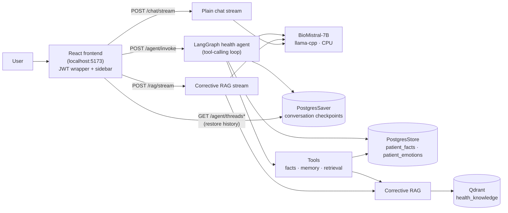
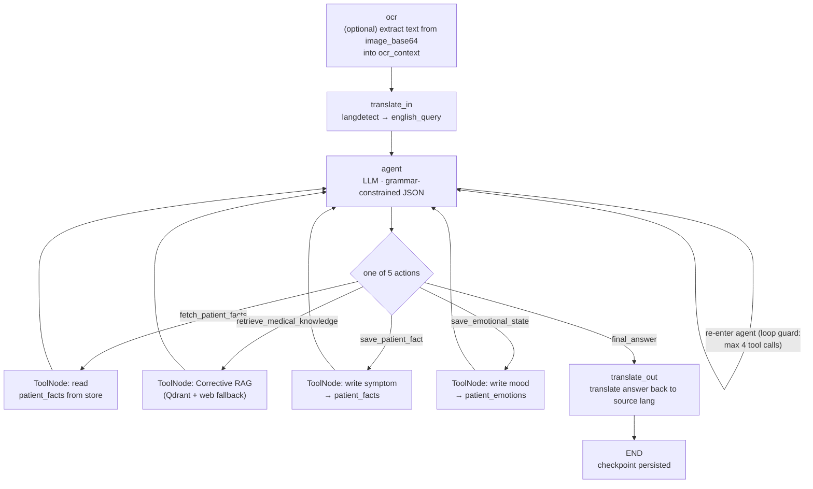
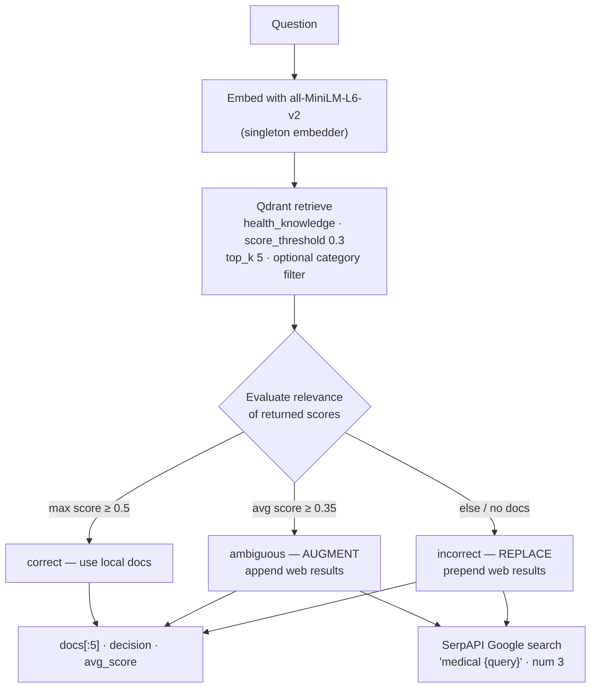
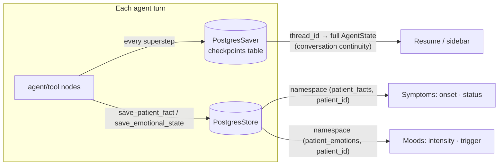
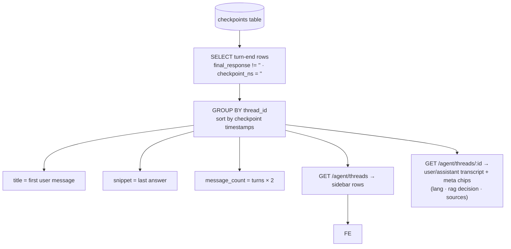
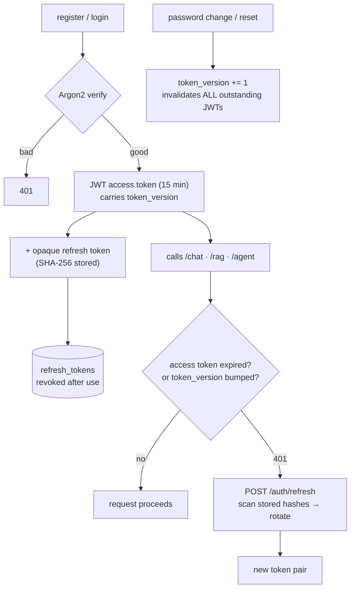

# Health Intelligence Companion

A full-stack medical Q&A application powered by a fine-tuned **BioMistral-7B** language model running locally via `llama-cpp-python`, augmented with a **Corrective Retrieval-Augmented Generation (Corrective RAG)** pipeline over a Qdrant vector store. Users sign up, verify their email, and chat with an AI health companion that streams responses token-by-token.

At its core the app runs a **LangGraph health agent** (`/agent/invoke`). The agent is a ReAct-style *tool-calling loop*: it can OCR an attached medical photo, translate Urdu/English input both ways, decide whether a question needs retrieval, pull evidence from a vector store, recall the patient's past symptoms, and remember new ones — all governed by a single grammar-constrained JSON schema so the model physically cannot emit invalid output. It is the preferred path over the two raw streaming endpoints (`/chat/stream`, `/rag/stream`).

Built as a final-year project (FYP 2026): the base model was fine-tuned with **QLoRA** on 10,000 balanced medical samples and quantized to GGUF (`Q4_K_M`) so it runs efficiently on CPU.

> ⚠️ **Disclaimer:** This application provides general health information only and does not constitute medical advice. Always consult a qualified healthcare professional for medical concerns.

---

## Table of Contents

- [Features](#features)
- [Tech Stack](#tech-stack)
- [Architecture at a glance](#architecture-at-a-glance)
- [Core flows (flow charts)](#core-flows)
- [Getting Started](#getting-started)
- [Environment Variables](#environment-variables)
- [Project Structure](#project-structure)
- [API Reference](#api-reference)
- [Testing](#testing)
- [Documentation](#documentation)
- [License](#license)

---

## Features

- 🤖 **LangGraph tool-calling agent (`/agent/invoke`)** — a ReAct loop where the LLM picks one of five actions per turn (fetch patient memory, retrieve medical knowledge, save a symptom, save an emotional state, or answer), with automatic conversation continuity (checkpointer) and persistent per-patient memory (store). Structured output is enforced by llama.cpp **grammars**.
- 💬 **Streaming chat** — token-by-token responses with a custom in-app Markdown renderer (code blocks, bold/italic, auto-linked URLs).
- 🔍 **Corrective RAG (`/rag/stream`)** — retrieves medical context from a Qdrant vector store, **evaluates** retrieval quality, and falls back to / augments with live web search when the local context is weak.
- 🌍 **Multilingual** — non-English queries (e.g. Urdu) are auto-detected, translated to English for the pipeline, and the answer is translated back.
- 🖼️ **Image (OCR) support** — an optional photo is run through Tesseract OCR and its text is injected into the *agent's* prompt as an "attached document", so a prescription or report becomes the subject of the answer.
- 🧠 **Two kinds of memory** — **facts** (symptoms with onset/status) and **emotional states** (mood with intensity/trigger), each persisted per patient in separate namespaces.
- 🗂️ **Conversation sidebar** — full per-patient chat history reconstructed directly from the agent's checkpoints; no separate conversation table.
- 🔐 **Full auth lifecycle** — register, login, refresh-token rotation, profile updates, password change/reset, email verification.
- 🛡️ **Token-based security** — short-lived JWTs with `token_version` invalidation, opaque SHA-256-hashed refresh/reset/verify tokens, Argon2 password hashing.
- 🔒 **Enforced password policy** — server-side validation (length, case, digits, specials, common-password blocklist) mirrored in the UI.
- 🎨 **Dark, responsive UI** — React 19 + Tailwind 4.

---

## Tech Stack

| Layer            | Technology                                                                    |
|------------------|-------------------------------------------------------------------------------|
| Agent framework  | LangGraph + `langgraph-checkpoint-postgres` (PostgresSaver + PostgresStore, psycopg) |
| Backend          | Python, FastAPI, Uvicorn, Pydantic v2, async SQLAlchemy + `asyncpg`          |
| LLM              | `llama-cpp-python` + BioMistral-7B GGUF (`Q4_K_M`), grammar-constrained output |
| Embeddings       | `sentence-transformers` (`all-MiniLM-L6-v2`)                                 |
| Vector store     | Qdrant (cloud) + web-search fallback via SerpAPI                              |
| Database         | PostgreSQL (Neon, serverless) — async engine + psycopg pool for LangGraph     |
| Translation      | `langdetect` + `deep-translator` (GoogleTranslator)                          |
| OCR              | `pytesseract` (Tesseract)                                                    |
| Auth             | JWT (`python-jose`), opaque tokens, Argon2 (`argon2-cffi`)                   |
| Frontend         | React 19, Vite 8, Tailwind 4, ESLint                                         |

---

## Architecture at a glance

The backend is a layered FastAPI app (`api/` → `schemas/` → `services/` → `models/` + `core/` + `db/`). Three request paths share one local LLM:



> The three routes share the same blocking GGUF model and the same Corrective RAG stack — only the *orchestration* in front of them differs. That orchestration is what the LangGraph agent adds (see below).

---

## Core flows

### 1. The LangGraph health agent — a ReAct tool loop

The agent is compiled in `app/agent/graph.py` as a **5-node** `StateGraph(AgentState)`:

```
ocr → translate_in → agent ⇄ tools → translate_out → END
```

The old fixed pipeline (separate router / rewriter / reasoner / extract-facts nodes) was replaced by a single **`agent` node** that runs the LLM against a grammar and lets the model *choose* its next action — this is the classic ReAct (Reason + Act) loop:



**How each piece works:**

- **`ocr` node** (`app/agent/nodes/ocr_node.py`) — if an `image_base64` was supplied, runs `pytesseract` and writes the extracted text into `state["ocr_context"]`. It is kept **separate** from `raw_input`/`english_query` so ~900 chars of document noise are never reprocessed by translation or routing; only the `agent` node injects it (as an *"Attached document…"* block) so the photo becomes the subject of the answer.
- **`translate_in` / `translate_out`** (`translate_node.py`) — detect `langdetect`, translate non-English input to English via `GoogleTranslator`, then translate the final answer back. English queries pass through unchanged.
- **`agent` node** (`app/agent/nodes/agent_node.py`) — builds `tool_results` by scanning the current turn's message history, formats the system prompt for the **`ToolCall`** schema, and calls `llm(..., grammar=_GRAMMAR)`. The schema enforces a flat `{thought, action, action_input, answer}` JSON with exactly five literal actions — deliberately small so the 7B model reasons about it reliably. On a parse failure it falls back to a safe `final_answer`.
- **`tools` node** (`app/agent/tools.py`) — LangChain `@tool` functions, executed by LangGraph's prebuilt `ToolNode`. `fetch_patient_facts` and `save_*` read/write the PostgresStore namespaces; `retrieve_medical_knowledge` runs the full Corrective RAG pipeline.
- **Loop guards** — `tool_call_count` is capped at **4** in the agent node (it forces `final_answer` once exhausted), and the invoke config adds `recursion_limit=15` as a graph-level safety net. No hung interleavings.
- **Per-turn metadata** — after each run, the agent node scans the turn's tool messages to report `needs_rag`, `retrieval_decision`, `sources`, and `saved_memory` (the sidebar meta chips and the `/agent/invoke` response). The scan is scoped to *this* turn, so a prior turn's retrieval doesn't leak onto later turns.
- **Auto-routing** — LangGraph's `tools_condition` routes back to `agent` when the last message has tool calls, and to `translate_out` when the agent produced a `final_answer`.

### 2. Corrective RAG — retrieve, evaluate, correct

Both the dedicated `/rag/stream` endpoint and the agent's `retrieve_medical_knowledge` tool call `app/core/rag/corrective_rag.py:corrective_retrieve(query, top_k=5)`:



- **Stage 1 — Retrieve:** `app/core/rag/qdrant_store.py:retrieve` embeds the query with a singleton `SentenceTransformer` and queries the `health_knowledge` collection (`score_threshold=0.3`, optional `category` payload filter). The client sets `timeout=60` and retries once on a transient error, so an autosuspended Qdrant cluster gets a chance to wake (same wake-up-retry pattern as the Neon pools).
- **Stage 2 — Evaluate:** `evaluate_relevance` classifies retrieval from score thresholds — `correct` when the **max** score ≥ `0.5`, `ambiguous` when the **avg** score ≥ `0.35`, otherwise `incorrect`.
- **Stage 3 — Correct:** on `incorrect` the weak local context is **replaced** with SerpAPI Google results (web results prepended); on `ambiguous` they are **appended** to augment it.
- **Resilience:** the agent's `retrieve_medical_knowledge` tool catches any retrieval / web-search failure and degrades gracefully (returns an "Error retrieving knowledge…" string), so a dead RAG backend reduces the agent to answering from patient facts rather than killing the turn.

### 3. Streaming — bridging a blocking LLM to async FastAPI

`llama-cpp-python`'s API is **synchronous** and blocking. Both streaming services (`app/services/chat_service.py` and `app/services/rag_chat_service.py`) push the blocking generator off the event loop with an identical producer/queue pattern:

```mermaid
sequenceDiagram
    participant Route as async route
    participant Loop as event loop
    participant Exec as thread executor
    participant LLM as llama.cpp (blocking)
    Route->>Loop: create asyncio.Queue
    Route->>Exec: loop.run_in_executor(producer)
    Exec->>LLM: create_chat_completion(stream=True)
    LLM-->>Exec: token deltas
    Exec->>Loop: call_soon_threadsafe(queue.put_nowait, delta)
    Route->>Queue: await queue.get()
    Loop-->>Route: delta
    Note over Route: yield to StreamingResponse
    Exec->>Loop: put sentinel (or Exception obj)
    Route->>Route: sentinel → stop | Exception → "Server Error"
```

The **RAG variant** prepends a retrieval step in the producer: it takes the last user message, runs `corrective_retrieve`, builds an augmented prompt via `_build_prompt` (inlines up to 3 doc texts, truncated to 300 chars each), replaces the final user turn with that prompt, and streams the completion.

> ⚠️ **Keep blocking calls off the event loop.** Never call `llm.create_chat_completion` directly from an async route — the whole server would freeze mid-token. The agent follows the same rule: `agent_service.run_agent` invokes the compiled graph with `run_in_threadpool(...)`.

### 4. Long-term memory — checkpointer + store



- **Checkpointer** (`app/db/lifespan.py` → `PostgresSaver`) persists the entire `AgentState` per `thread_id` after every superstep. Conversation continuity is free: a resumed thread resumes from its last checkpoint.
- **Store** (`PostgresStore`) keeps long-term per-patient memory under two namespaces: `("patient_facts", patient_id)` and `("patient_emotions", patient_id)`. `fetch_patient_facts` searches it before answering; the save tools write to it.
- **Neon survival** — both backends sit on a **shared psycopg `ConnectionPool`** (`app/db/pool.py`), not a bare connection. The pool pings on every checkout and reconnects after idle drops, and it deliberately connects to Neon's **direct** endpoint (the `-pooler.` host is stripped) because the saver/store hold long-lived connections with server-side prepared statements that a transaction-mode pooler aborts. `.setup()` (table creation) runs once at FastAPI lifespan start; pools close on shutdown.
- **Wake-up retries** — `agent_service.run_agent` retries a transient `psycopg.OperationalError` (Neon compute-wake race: the pool's ping can race the compute waking). `conversation_service` applies the same pattern.

### 5. Conversation sidebar — reconstructed from checkpoints

There is deliberately **no conversation table**. A conversation is exactly the chronological sequence of a thread's *turn-end* checkpoints — the ones whose `final_response` is non-empty (intermediate superstep checkpoints carry an empty one and are filtered with `checkpoint_ns = ''`):



Queries run through the same checkpointer psycopg pool and select only named fields, so `image_base64` blobs never leave the DB. Ownership is enforced via the `patient_id` stored inside each state, matched to the authenticated `user.id`.

### 6. Auth & token lifecycle



- **Access tokens** are short-lived JWTs (15 min) carrying a `token_version` claim; `app/deps.py:get_current_user` rejects any JWT whose version no longer matches the user's.
- **Opaque tokens** (refresh, password-reset, email-verify) are random `secrets.token_urlsafe(48)` values; only their **SHA-256 hash** is stored. Verification is constant-time via `secrets.compare_digest`, so lookups scan all matching rows and hash-compare — an intentional O(n) trade-off since hashes can't be reversed.
- **Refresh rotation** — a used refresh token is marked `revoked` and a fresh pair issued.
- **Role gating** — `require_role(*roles)` in `deps.py`.
- **Email** — when `SMTP_HOST` is empty (dev), emails are logged to console instead of sent.

---

## Getting Started

### Prerequisites

- **Python 3.11+** with a conda (or venv) environment
- **Node.js 18+** and npm
- The fine-tuned **BioMistral-7B GGUF model** (see [Model Setup](#model-setup))
- A **Qdrant** instance with the `health_knowledge` collection populated
- A **PostgreSQL** database (the project uses Neon serverless Postgres)
- **Tesseract** OCR engine (for the agent's image input) — `choco install tesseract` / `apt install tesseract-ocr`
- Network access to **Google Translate** (used by the agent's multilingual nodes)

### 1. Backend

```bash
# Create and activate an environment
conda create -n ft-project python=3.11
conda activate ft-project

# Install dependencies (includes the RAG, agent, translation, and OCR stacks)
pip install -r requirements.txt

# Configure environment — copy the required keys into a .env at the repo root
# (see Environment Variables below)

# Tesseract is required for the image/OCR node (installed separately)
#   Windows: choco install tesseract   |   Ubuntu: sudo apt install tesseract-ocr

# Run the API server (http://localhost:8000)
uvicorn app.main:app --reload
```

> ⏳ **Startup is slow by design:** the GGUF model and embedding model load once at server start, so the first `/docs` or request can take a while.

### 2. Frontend

```bash
cd frontend
npm install
npm run dev     # http://localhost:5173
```

The frontend calls `http://localhost:8000` (hardcoded as the API base in `src/utils/api.js`, `src/context/AuthContext.jsx`, `src/utils/session.js`, and `src/components/ChatWindow.jsx`).

### 3. Model setup

Chat runs against the locally fine-tuned **BioMistral-7B** model in GGUF format. The model loads once at server startup (`app/core/llm.py` — `n_ctx=2048`, `n_threads=os.cpu_count()`, `n_batch=512`).

1. Obtain the `biomistral-Q4_K_M.gguf` file (the fine-tune pipeline is documented in [`docs/solution.md`](docs/solution.md) and [`docs/training-report.md`](docs/training-report.md)).
2. Place it anywhere on disk and point `MODEL_PATH` at it in `.env` — or put it at the default path in `app/config.py`.

---

## Environment Variables

All configuration is read from a `.env` file at the repo root via `pydantic-settings` (`app/config.py`). The following are **required** — the app validates them on startup:

```env
# Database (PostgreSQL/Neon) — the async app engine
DATABASE_URL=postgresql+asyncpg://<user>:<password>@<host>/<dbname>

# Qdrant vector store
QDRANT_URL=<your-qdrant-url>
QDRANT_API_KEY=<your-qdrant-api-key>

# Auth & embeddings
SECRET_KEY=<a-long-random-secret>
HF_TOKEN=<huggingface-token>      # used to fetch the embedding model

# Web-search fallback (Corrective RAG correction step)
SERP_API_KEY=<your-serpapi-key>

# Validated at startup (reserved for future use)
GROQ_API_KEY=<your-groq-key>
```

Optional — email delivery (dev mode logs emails to console when unset):

```env
SMTP_HOST=
SMTP_PORT=587
SMTP_USER=
SMTP_PASSWORD=
SMTP_FROM=
```

Optional tuning via `app/config.py`:

| Variable                      | Default                                            | Purpose                                  |
|-------------------------------|----------------------------------------------------|------------------------------------------|
| `MODEL_PATH`                  | `C:\Users\jason\.cache\models\biomistral-Q4_K_M.gguf` | Path to the GGUF model file          |
| `ACCESS_TOKEN_EXPIRE_MINUTES` | `15`                                               | JWT access-token lifetime                |
| `REFRESH_TOKEN_EXPIRE_DAYS`   | `7`                                                | Refresh-token lifetime                   |
| `RESET_TOKEN_EXPIRE_HOURS`    | `1`                                                | Password-reset token TTL                 |
| `VERIFY_TOKEN_EXPIRE_HOURS`   | `48`                                               | Email-verify token TTL                   |
| `CORS_ORIGINS`                | `["http://localhost:5173"]`                        | Allowed frontend origins                 |

> The database schema is created automatically on startup from the SQLAlchemy models (`Base.metadata.create_all`) and the LangGraph checkpointer/store (`PostgresSaver.setup` / `PostgresStore.setup`). No manual migrations are required.

---

## Project Structure

```
├── app/                      # FastAPI backend
│   ├── agent/                # LangGraph agent: graph, state, tools, nodes/
│   │   └── nodes/            #   ocr_node, translate_node, agent_node
│   ├── api/                  # Routers: auth, chat, rag, agent
│   ├── core/                 # LLM wrapper, security/tokens, password policy
│   │   └── rag/              # embedder, qdrant_store, corrective_rag, translation, ocr
│   ├── db/                   # Async engine+session, shared psycopg pool,
│   │   │                     #   LangGraph lifespan (checkpointer + store)
│   │   ├── session.py        #   async SQLAlchemy engine (Neon-tuned)
│   │   ├── pool.py           #   shared psycopg ConnectionPool for LangGraph
│   │   └── lifespan.py       #   checkpointer (PostgresSaver) + store (PostgresStore)
│   ├── models/               # SQLAlchemy models (User, RefreshToken, Token)
│   ├── schemas/              # Pydantic request/response models (incl. Agent schemas)
│   ├── services/             # chat, RAG chat, agent service, conversation service
│   ├── eval/                 # Standalone evals: hallucination, perplexity, RAG scoring
│   ├── tests/                # Standalone smoke scripts (not a pytest suite)
│   ├── utils/                # Email, logging
│   ├── deps.py               # Auth dependencies (get_current_user, require_role)
│   ├── config.py             # Settings (pydantic-settings)
│   └── main.py               # App entry point, lifespan, CORS
├── frontend/                 # React + Vite UI
│   └── src/
│       ├── components/       # ChatBox, ChatWindow (3-mode selector), Sidebar, modals
│       ├── context/          # AuthContext (useAuth), ConversationsContext (sidebar)
│       └── utils/api.js      # JWT-aware fetch wrapper
├── docs/                     # Project notes, flow-charts, model-evaluation reports
└── requirements.txt          # Pinned Python dependencies
```

---

## API Reference

All routes live under `app/api/`. The **`chat` / `rag` / `agent` invoke** endpoints accept requests directly; the **sidebar history** endpoints (`/agent/threads*`) are protected by the OAuth2 bearer `get_current_user`.

### Auth — `/auth`

| Method | Endpoint                  | Description                                        |
|--------|---------------------------|----------------------------------------------------|
| POST   | `/auth/register`          | Create an account (returns tokens — auto-login)    |
| POST   | `/auth/login`             | Authenticate, receive access + refresh tokens      |
| POST   | `/auth/refresh`           | Rotate a refresh token for a new pair              |
| GET    | `/auth/me`                | Current user profile                               |
| PATCH  | `/auth/me`                | Update profile (`full_name`, `email`)             |
| PUT    | `/auth/me/password`       | Change password (signs out all sessions)           |
| DELETE | `/auth/me`                | Delete account (requires `confirmation: "DELETE"`) |
| POST   | `/auth/forgot-password`   | Email a reset link                                 |
| POST   | `/auth/reset-password`    | Complete a password reset                          |
| POST   | `/auth/send-verification` | Send an email-verification link                    |
| GET    | `/auth/verify-email`      | Verify an email via one-time token                 |

### Chat — `/chat`

| Method | Endpoint       | Description                                   |
|--------|----------------|-----------------------------------------------|
| POST   | `/chat/stream` | Stream a plain chat completion (no retrieval) |

```json
// POST /chat/stream
{
  "messages": [
    { "role": "user", "content": "What are the symptoms of vitamin D deficiency?" }
  ],
  "temperature": 0.7,
  "max_tokens": 1024
}
```

### RAG — `/rag`

| Method | Endpoint      | Description                                                |
|--------|---------------|------------------------------------------------------------|
| POST   | `/rag/stream` | Corrective RAG: retrieve context, then stream a completion |

```json
// POST /rag/stream
{
  "messages": [
    { "role": "user", "content": "What are the symptoms of diabetes?" }
  ],
  "temperature": 0.7,
  "max_tokens": 1024
}
```

### Agent — `/agent`

| Method | Endpoint                  | Description                                                                      |
|--------|---------------------------|----------------------------------------------------------------------------------|
| POST   | `/agent/invoke`           | Run the full tool-calling health agent (OCR → translate → ReAct loop → answer)   |
| GET    | `/agent/threads`          | List the patient's conversations, newest first (sidebar rows)                    |
| GET    | `/agent/threads/{id}`     | Full transcript of one conversation, with per-turn meta chips                     |

```json
// POST /agent/invoke
{
  "patient_id": "user-42",
  "query": "مجھے بخار ہے",              // or English, or attach an image
  "thread_id": "a1b2c3d4-...",           // optional — one UUID per conversation;
                                         //   defaults to patient_id (pre-sidebar clients)
  "image_base64": "<base64>…"            // optional — OCR'd before the agent runs
}
```

```json
// 200 OK
{
  "answer": "I understand you have a fever…",
  "detected_lang": "ur",
  "needs_rag": true,
  "retrieval_decision": "correct",
  "sources": ["source-a.md", "source-b.md"],
  "save_memory": true
}
```

Interactive API docs are available at `http://localhost:8000/docs` (Swagger UI) when the server is running.

---

## Testing

The `app/tests/` directory contains **standalone smoke scripts** — not a `pytest` suite (`pytest`/`httpx` are not in `requirements.txt`). They hit real Qdrant / the real LLM, so run them against a live backend:

```bash
conda activate ft-project
python app/tests/test_qdrant.py          # retrieval from Qdrant
python app/tests/test_embedder.py        # embedding model loads and embeds
python app/tests/test_corrective_rag.py  # full Corrective RAG pipeline
python app/tests/test_rag_chat_stream.py # stream a RAG completion
python app/tests/test_chat.py            # POST /chat/stream via TestClient
python app/tests/test_auth.py            # register/login/refresh flow against live API
python app/tests/test-ocr.py             # POST an image through /agent/invoke (OCR + answer)
```

**Agent end-to-end (the tool-binding loop):**

```bash
python app/tests/test_week6_agent.py     # 4 turns on one patient: greeting → symptom →
                                         #   "same fever from before?" (proves fetch_patient_facts)
                                         #   → "I'm scared" (proves save_emotional_state)
```

Quick live check against a running server:

```bash
curl -X POST http://localhost:8000/agent/invoke -H "Content-Type: application/json" \
  -d '{"patient_id":"p1","query":"I have had a fever for two days"}'
```

---

## Documentation

The [`docs/`](docs/) directory contains research notes, the fine-tuning pipeline, and evaluation results, including the agent's own design flow charts in [`docs/flow-charts/`](docs/flow-charts/):

- [`docs/solution.md`](docs/solution.md) — converting the merged fine-tuned model to GGUF
- [`docs/training-report.md`](docs/training-report.md) — QLoRA training + evaluation metrics (ROUGE, BERTScore, medical accuracy)
- [`docs/basemodel-vs-ftmodel.md`](docs/basemodel-vs-ftmodel.md) — base vs. fine-tuned comparison
- [`docs/rag-vs-ft-report.md`](docs/rag-vs-ft-report.md) — Corrective RAG vs. fine-tuning comparison
- [`docs/agentic-rag-roadmap.md`](docs/agentic-rag-roadmap.md) — the Corrective RAG design roadmap
- [`docs/flow-charts/`](docs/flow-charts/) — agent-pipeline design notes (`agent-infra.md`, `router-node.md`, `rewriter.md`, `ocr-node.md`, `translate-node.md`, `translation.md`, `rag-eval.md`)
- [`docs/urdu-translater.md`](docs/urdu-translater.md) — multilingual (Urdu) translation notes
- Plus weekly progress notes (`week1.md`–`week6-part2.md`), the project proposal, and evaluation metrics

---

## License

All rights reserved. This project is developed for academic purposes as a final-year project.