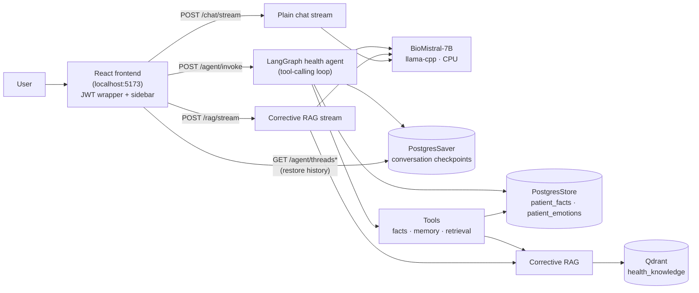
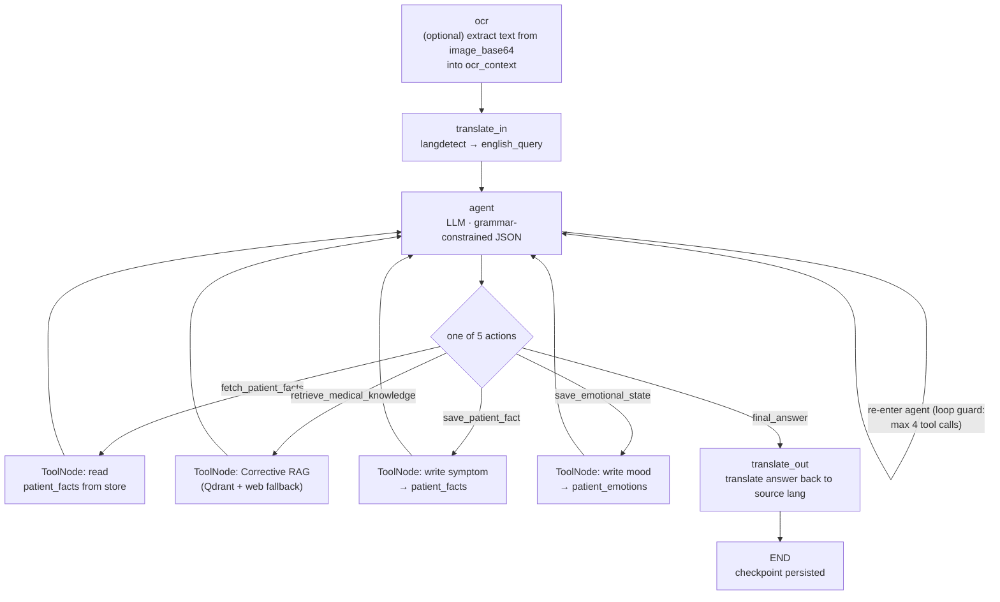
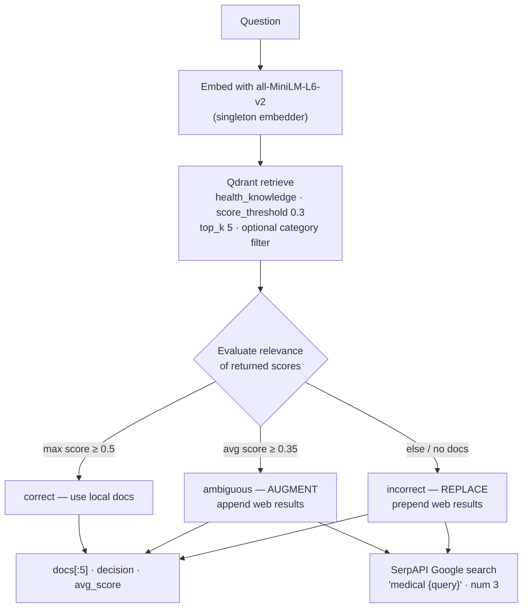
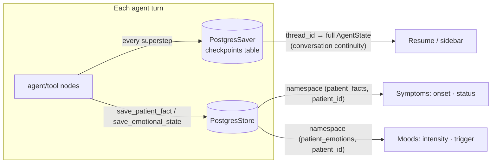
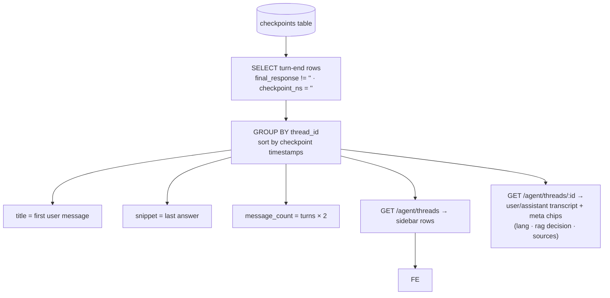
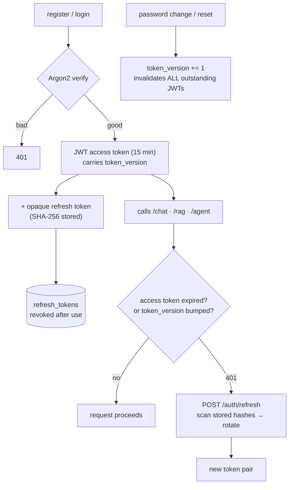

# Codebase Context

## File: `CLAUDE.md`

```markdown
# CLAUDE.md

This file provides guidance to Claude Code (claude.ai/code) when working with code in this repository.

## Project overview


**Health Intelligence Companion** — a full-stack medical Q&A app with user auth. Two parts, run independently:

- **Backend** (`app/`): FastAPI + async SQLAlchemy (asyncpg → Neon Postgres), token-based auth, and local LLM inference via `llama-cpp-python` (BioMistral-7B GGUF). Serves the chat stream at `/chat/stream`, a Corrective-RAG stream at `/rag/stream`, a LangGraph agent at `/agent/invoke`, and the auth API under `/auth`.
- **Frontend** (`frontend/`): React 19 + Vite 8 + Tailwind 4. Auth wire-up via localStorage JWT; chat via streaming `fetch`.

## Environment

- Backend Python runs in the **conda env `ft-project`** (`C:\miniconda3\envs\ft-project`). Dependencies are pinned in `requirements.txt` — install with `conda activate ft-project && pip install -r requirements.txt`.
- All secrets live in root `.env` (gitignored): `DATABASE_URL` (Neon/Postgres), `SECRET_KEY`, `QDRANT_URL`, `QDRANT_API_KEY`, `GROQ_API_KEY`, `HF_TOKEN`, plus dev username/password. Do **not** commit or echo these values. `app/config.py` reads them via `pydantic-settings`.

## Commands

```bash
# Backend (from repo root, conda env ft-project), port 8000
uvicorn app.main:app --reload

# Frontend (from frontend/), port 5173  — hardcoded API base http://localhost:8000
npm run dev
npm run build
npm run lint   # ESLint (frontend only)
```

There is **no backend linter configured** and no pytest integration (`pytest`/`httpx` are not in `requirements.txt`). `app/tests/*.py` are standalone scripts, not a pytest suite — run them directly against a live backend (they hit real Qdrant/LLM): `conda activate ft-project && python app/tests/test_qdrant.py`. `app/tests/test-ocr.py` posts `app/tests/sample-report.png` through `/agent/invoke` (`image_base64` + a query, default `"what it mean"`) and prints the OCR'd text plus the answer — the quickest way to exercise the OCR/rewriter/reasoner path end-to-end. `app/db/session.py:init_models` creates tables directly from the SQLAlchemy models on startup via `Base.metadata.create_all` — there are **no Alembic migrations in use** (alembic is in `requirements.txt` but the code path is unused).

## Backend architecture

FastAPI app assembled in `app/main.py`: registers `auth`, `chat`, `rag` (streaming RAG), and `agent` (LangGraph) routers, adds CORS (default `http://localhost:5173`), and on startup (`lifespan`) runs `validate_settings()` then `get_embedder()` then `await init_models()`.

`app/config.py` `Settings` covers everything `main.py:validate_settings` reads (`DATABASE_URL`, `SECRET_KEY`, `QDRANT_URL`, `GROQ_API_KEY`, …) plus `SERP_API_KEY` (SerpAPI web-search fallback in `corrective_rag.py`) and `MODEL_PATH` — the only two with defaults are `MODEL_PATH` and `CORS_ORIGINS`.

Layered layout: `api/` (routers) → `schemas/` (Pydantic request/response) → `services/` (business logic) → `models/` (SQLAlchemy) + `core/` (security, password policy, LLM, rag) + `utils/` (email, logging). `deps.py` provides auth dependencies.

### Streaming chat (the non-obvious part)

`app/core/llm.py` loads the GGUF model **at import time** (module-level `llm = Llama(model_path=settings.MODEL_PATH, n_ctx=2048, n_threads=os.cpu_count(), n_batch=512)`). This is blocking and expensive — it happens when the app starts, so server startup is slow, and `llama_cpp`'s API is synchronous. `n_threads`/`n_batch` fixed the multi-minute latency that came from the old default threads, but node latency is still tens of seconds: the grammar-constrained nodes (`router`, `extract_facts`) and 7B-on-CPU inference are the bottleneck — expect that during debug, not single digits.

`app/services/chat_service.py:stream_chat` bridges that sync generator to async: it runs a producer in a **thread executor** (`loop.run_in_executor`) that pushes each content delta into an `asyncio.Queue` via `loop.call_soon_threadsafe`, and the async consumer yields items. Sentinels/exception objects are pushed through the same queue to signal completion/errors. Keep the blocking LLM call off the event loop — do not call `llm.create_chat_completion` directly from an async route.

### RAG (`/rag`) — Corrective RAG

`app/services/rag_chat_service.py:stream_rag_chat` mirrors the streaming bridge above but prepends a retrieval step in the producer: it takes the last user message, runs `app/core/rag/corrective_rag.py:corrective_retrieve`, builds an augmented prompt via `_build_prompt` (inlines up to 3 doc texts, truncated to 300 chars each), and replaces the final user turn with that augmented prompt before calling `llm.create_chat_completion`. Same queue/sentinel mechanics as the plain chat stream.

`corrective_retrieve(query, top_k=5)` is a three-stage Corrective RAG pipeline:
1. **Retrieve** from Qdrant via `qdrant_store.retrieve` — embeds the query with a singleton `SentenceTransformer` (`all-MiniLM-L6-v2`, loaded once via `get_embedder()`), queries the `health_knowledge` collection (`score_threshold=0.3`, optional `category` payload filter), and returns docs with `text`/`source`/`category`/`score`.
2. **Evaluate** via `evaluate_relevance` — classifies retrieval as `correct` / `ambiguous` / `incorrect` from score thresholds (`RELEVANCE_THRESHOLD=0.5` on max score, `AMBIGUOUS_THRESHOLD=0.35` on avg score).
3. **Correct** — on `incorrect` it **replaces** the context with SerpAPI Google results (prepended) + retrieved docs; on `ambiguous` it **augments** (appended). Returns the top-5 docs, `decision`, and average score.

The `rag` router (`app/api/rag.py`) is registered in `app/main.py`, so `/rag/stream` is live. `app/core/rag/qdrant_store.py` instantiates the `QdrantClient` and `embedder` **at import time** (module-level), so importing it at app startup blocks on a live Qdrant connection and model load. **Resilience:** Qdrant Cloud free tier autosuspends an idle cluster (the first query has to wake it and can blow past the default read timeout), so `qdrant_store.py` sets `timeout=60` on the client and retries `query_points` once on a transient error — the same wake-up-retry pattern as the Neon retries in `agent_service.py`. The agent's `rag_node` additionally catches any retrieval/web-search failure and continues with `retrieval_decision="failed"` and empty docs, so a dead RAG backend degrades the agent to answering from `ocr_context`/facts instead of killing the whole turn.

### Agent (`/agent/invoke`) — LangGraph health assistant

A multi-node LangGraph pipeline (`app/agent/`) that wraps the RAG + LLM stack into one flow with automatic conversation memory and persistent per-patient fact storage. It is the newer, preferred path over the plain `/chat/stream` and `/rag/stream` endpoints — extend it rather than adding new chat endpoints.

- **Graph** (`app/agent/graph.py`): `build_health_agent()` compiles a `StateGraph(AgentState)` in this order: `ocr` → `translate_in` → `router` → `fetch_facts` → (conditional) `rewrite` → `rag` → `reasoner` → `extract_facts` → `translate_out` → END. After `fetch_facts`, routing to `rewrite` vs `reasoner` depends on the router's `needs_rag` flag.
- **State** (`app/agent/state.py`): `AgentState` is a `TypedDict` carrying `raw_input`, `detected_lang`/`english_query`, `needs_rag`/`save_memory`, `retrieved_docs`, `patient_facts`, `answer`, `final_response`, etc.
- **Structured output via grammar**: the `router` and `extract_facts` nodes compile a Pydantic schema (`RouterDecision`, `SymptomFact` in `app/schemas/agent.py`) into a llama.cpp grammar (`LlamaGrammar.from_json_schema`) so the model **cannot** emit output that fails validation. The `router` node validates and falls back to a safe default (`needs_rag=True, save_memory=True`) on parse failure.
- **Checkpointer** (`app/db/checkpointer.py`): LangGraph `PostgresSaver` persists the full `AgentState` per `thread_id`, giving free conversation continuity — no manual memory queries. **Important**: it uses psycopg, so it rewrites `postgresql+asyncpg` → `postgresql` on `DATABASE_URL`, **and it connects to Neon's *direct* endpoint, not the `-pooler` (PgBouncer transaction-mode) one** — the saver holds long-lived connections and uses server-side prepared statements (`prepare_threshold=0`) + binary cursors, which a transaction-mode pooler aborts (`Software caused connection abort`); the direct endpoint gives real sessions. Both it and `app/db/store.py` are module-level singletons with idempotent `.setup()` on import. Both are built on a **`psycopg_pool.ConnectionPool`** (shared builder `app/db/pool.py`), not a bare connection: Neon autosuspend drops idle connections, and a bare psycopg conn has no reconnect path — the first request after idle dies with `SSL connection has been closed unexpectedly`. The pool's default `check` pings every checkout (the sync analogue of the async engine's `pool_pre_ping=True`) and reconnects. `run_agent` additionally retries a transient `psycopg.OperationalError` (Neon compute-wake race). If a `psycopg.OperationalError` reappears, suspect the pool was bypassed or the endpoint reverted to the pooler.
- **Fact memory** (`app/db/store.py`): LangGraph `PostgresStore` keeps symptom facts under namespace `("patient_facts", patient_id)`, so a fact like "fever last week" survives across unrelated turns. `fetch_facts` searches it before answering; `extract_facts` writes to it when the router's `save_memory` is true.
- **Multilingual & OCR**: `translate_in`/`translate_out` use `app/core/rag/translation.py` (langdetect + `GoogleTranslator`) to detect and round-trip non-English (e.g. Urdu) queries; `ocr` uses `pytesseract` (`app/core/rag/ocr.py`) when an `image_base64` is supplied. **It stores the extracted text in `state["ocr_context"]`, kept separate from `raw_input`/`english_query`** — it used to be appended to `raw_input`, which fed ~900 chars of OCR noise through every node and caused a ~9-minute turn *and* a wrong rewrite (image + `"what it mean"` became the template question `"what is the correct format for a medical prescription…"`). Only `reasoner_node` injects `ocr_context` (as `Attached document…`) into the answer prompt — that's what lets it actually explain the prescription; `rewriter_node` only checks `ocr_context`'s presence to preserve document-explain intent.
- **Threading**: `app/services/agent_service.py` compiles the graph once at import and `run_agent` invokes it via `run_in_threadpool(agent.invoke, state, config)` — LangGraph's sync API must stay off the event loop, same pattern as the streaming bridge. `thread_id` now comes from `AgentRequest.thread_id` (one UUID per conversation, minted by the frontend); it **defaults to `patient_id`** when absent so pre-sidebar clients keep resuming the single per-patient thread.
- **Conversation history (sidebar)**: there is deliberately **no separate conversation table** — `app/services/conversation_service.py` reconstructs conversations directly from the checkpointer's `checkpoints` rows. A conversation is the chronological sequence of *turn-end* checkpoints for a thread, identified by `final_response` being non-empty (intermediate superstep checkpoints carry an empty one and are filtered out with `checkpoint_ns = ''`). It queries through `checkpointer.conn` (same psycopg pool, same Neon retry-on-OperationalError pattern as `agent_service.py`), selecting only named fields so `image_base64` blobs never leave the DB. Endpoints live on the agent router: `GET /agent/threads` (sidebar rows, newest first) and `GET /agent/threads/{thread_id}` (full transcript with per-turn meta chips — lang, rag decision, sources), both auth-gated by `get_current_user`.
- **Graph logging**: `app/agent/graph.py` wraps every node with a `_logged(node_name)` decorator that logs entry/exit, elapsed time, and tags any exception with the failing node via `logger.exception`. Nodes log their own decisions (translation lang, router/rewriter/retrieval/answer outcomes) through the shared `app/utils/logging_config.py:get_logger` template — errors land in `logs.txt` alongside auth/RAG.

### Auth & tokens

`app/core/security.py`:
- **Access tokens**: short-lived JWTs (default 15 min) carrying a `token_version` claim.
- **Opaque tokens**: refresh, password-reset, and email-verify tokens are random `secrets.token_urlsafe(48)` values; only their **SHA-256 hash** is stored in the DB (`refresh_tokens`, `tokens` tables). Verification is constant-time via `secrets.compare_digest`. Because hashes can't be reversed, refreshing/reset/verify lookups **scan all matching rows and hash-compare** (documented as intentional O(n)).
- **Revocation**: bumping a user's `token_version` (on password change/reset) invalidates all outstanding JWTs via the check in `app/deps.py:get_current_user`. Refresh tokens are rotated (marked `revoked` after use).
- Password hashing uses argon2 (`argon2-cffi`). Helper `require_role(*roles)` in `deps.py` for role-gating.

### Password policy

`app/core/password_policy.py` is the **source of truth** for password strength (length, case, digit, special char, common-password blocklist). The backend enforces it in `app/schemas/auth.py` via `model_validator` on register/reset/change schemas; the frontend `RegisterModal` mirrors these rules for UX only. Change rules here, then update the mirror.

### DB & email

- `app/db/session.py`: async engine tuned for Neon — `pool_pre_ping=True` and `pool_recycle=300` (seconds) to survive Neon's idle connection drops; `connect_args={"timeout": 60}`. Sessions via `async_sessionmaker(…, expire_on_commit=False)`.
- `app/utils/email.py`: when `SMTP_HOST` is empty (dev), emails are **logged to console** instead of sent. Set `SMTP_*` vars to activate real sending.
- `app/utils/logging_config.py`: `get_logger()` writes to console + `logs.txt`; `log_auth_event()` emits structured auth lines.

## Frontend notes

- API base is hardcoded `http://localhost:8000` in **four** places: `src/utils/api.js`, `src/context/AuthContext.jsx`, `src/utils/session.js`, and `src/components/ChatWindow.jsx` (line 317; the same host is echoed in an error string near line 404). `ChatBox.jsx` is now just the auth-gated layout wrapper (sidebar + window) and holds no API base.
- `api.js` is a thin JWT wrapper: auto-attaches `access_token` from localStorage, and on a 401 tries a **silent refresh** (`/auth/refresh`) and retries once; only if the refresh fails does it dispatch `auth:unauthorized` (listened for in `AuthContext.jsx`) to force logout.
- `AuthContext.jsx` owns auth state; any auth screen should use `useAuth()`. The full session — access token + 7-day refresh token + cached user profile — is persisted in localStorage via `src/utils/session.js`, so a page reload or backend restart keeps the user signed in. On mount a **network error** (server restarting) keeps the cached session and retries instead of logging out; a 401 triggers a silent refresh. `refreshSession()` dispatches `auth:session-refreshed` to keep React state in sync.
- `ChatWindow.jsx` is the chat UI. It has a 3-mode selector — **Agent** (default, `POST /agent/invoke`), **RAG** (`/rag/stream`), **Chat** (`/chat/stream`) — and streams the two stream endpoints via a `ReadableStream` reader while rendering assistant Markdown with a custom light renderer (code blocks, bold/italic, auto-linked URLs) — no `react-markdown` dependency.
- **Conversation sidebar**: `ConversationsContext.jsx` is the single owner of the sidebar list, the active LangGraph `thread_id` (a fresh `crypto.randomUUID()` per new chat), and the restored message transcript — all fetched from `/agent/threads*`, no local store. `App.jsx` keys the provider by `user.id`, so signing out/in or switching patients remounts it and one patient never sees another's threads. `Sidebar.jsx` + `ConversationItem.jsx` render the list (desktop 280px rail that collapses, plus a mobile slide-in drawer); `utils/time.js` formats relative timestamps.
- Tailwind 4 is wired through `@tailwindcss/vite` in `vite.config.js`.

## Docs

`docs/` holds project notes — including `solution.md` and `training-report.md` describing the fine-tuning of the base model (BioMistral-7B, QLoRA, converted to GGUF for `llama-cpp-python`) and its eval metrics, plus `docs/flow-charts/` with the agent-pipeline design notes (`agent-infra.md`, `ocr-node.md`, `router-node.md`, `rewriter.md`, `translate-node.md`, `translation.md`). These are context around the ML pipeline, not required to run the app.
```

---

## File: `README.md`

```markdown
# Health Intelligence Companion

A full-stack medical Q&A application powered by a fine-tuned **BioMistral-7B** language model running locally via `llama-cpp-python`, augmented with a **Corrective Retrieval-Augmented Generation (Corrective RAG)** pipeline over a Qdrant vector store. Users sign up, verify their email, and chat with an AI health companion that streams responses token-by-token.

At its core the app runs a **LangGraph health agent** (`/agent/invoke`). The agent is a ReAct-style *tool-calling loop*: it can OCR an attached medical photo, translate Urdu/English input both ways, decide whether a question needs retrieval, pull evidence from a vector store, recall the patient's past symptoms, and remember new ones — all governed by a single grammar-constrained JSON schema so the model physically cannot emit invalid output. It is the preferred path over the two raw streaming endpoints (`/chat/stream`, `/rag/stream`).

Built as a final-year project (FYP 2026): the base model was fine-tuned with **QLoRA** on 10,000 balanced medical samples and quantized to GGUF (`Q4_K_M`) so it runs efficiently on CPU.

> ⚠️ **Disclaimer:** This application provides general health information only and does not constitute medical advice. Always consult a qualified healthcare professional for medical concerns.

---

## Table of Contents

- [Features](#features)
- [Tech Stack](#tech-stack)
- [Architecture at a glance](#architecture-at-a-glance)
- [Core flows (flow charts)](#core-flows)
- [Getting Started](#getting-started)
- [Environment Variables](#environment-variables)
- [Project Structure](#project-structure)
- [API Reference](#api-reference)
- [Testing](#testing)
- [Documentation](#documentation)
- [License](#license)

---

## Features

- 🤖 **LangGraph tool-calling agent (`/agent/invoke`)** — a ReAct loop where the LLM picks one of five actions per turn (fetch patient memory, retrieve medical knowledge, save a symptom, save an emotional state, or answer), with automatic conversation continuity (checkpointer) and persistent per-patient memory (store). Structured output is enforced by llama.cpp **grammars**.
- 💬 **Streaming chat** — token-by-token responses with a custom in-app Markdown renderer (code blocks, bold/italic, auto-linked URLs).
- 🔍 **Corrective RAG (`/rag/stream`)** — retrieves medical context from a Qdrant vector store, **evaluates** retrieval quality, and falls back to / augments with live web search when the local context is weak.
- 🌍 **Multilingual** — non-English queries (e.g. Urdu) are auto-detected, translated to English for the pipeline, and the answer is translated back.
- 🖼️ **Image (OCR) support** — an optional photo is run through Tesseract OCR and its text is injected into the *agent's* prompt as an "attached document", so a prescription or report becomes the subject of the answer.
- 🧠 **Two kinds of memory** — **facts** (symptoms with onset/status) and **emotional states** (mood with intensity/trigger), each persisted per patient in separate namespaces.
- 🗂️ **Conversation sidebar** — full per-patient chat history reconstructed directly from the agent's checkpoints; no separate conversation table.
- 🔐 **Full auth lifecycle** — register, login, refresh-token rotation, profile updates, password change/reset, email verification.
- 🛡️ **Token-based security** — short-lived JWTs with `token_version` invalidation, opaque SHA-256-hashed refresh/reset/verify tokens, Argon2 password hashing.
- 🔒 **Enforced password policy** — server-side validation (length, case, digits, specials, common-password blocklist) mirrored in the UI.
- 🎨 **Dark, responsive UI** — React 19 + Tailwind 4.

---

## Tech Stack

| Layer            | Technology                                                                    |
|------------------|-------------------------------------------------------------------------------|
| Agent framework  | LangGraph + `langgraph-checkpoint-postgres` (PostgresSaver + PostgresStore, psycopg) |
| Backend          | Python, FastAPI, Uvicorn, Pydantic v2, async SQLAlchemy + `asyncpg`          |
| LLM              | `llama-cpp-python` + BioMistral-7B GGUF (`Q4_K_M`), grammar-constrained output |
| Embeddings       | `sentence-transformers` (`all-MiniLM-L6-v2`)                                 |
| Vector store     | Qdrant (cloud) + web-search fallback via SerpAPI                              |
| Database         | PostgreSQL (Neon, serverless) — async engine + psycopg pool for LangGraph     |
| Translation      | `langdetect` + `deep-translator` (GoogleTranslator)                          |
| OCR              | `pytesseract` (Tesseract)                                                    |
| Auth             | JWT (`python-jose`), opaque tokens, Argon2 (`argon2-cffi`)                   |
| Frontend         | React 19, Vite 8, Tailwind 4, ESLint                                         |

---

## Architecture at a glance

The backend is a layered FastAPI app (`api/` → `schemas/` → `services/` → `models/` + `core/` + `db/`). Three request paths share one local LLM:



> The three routes share the same blocking GGUF model and the same Corrective RAG stack — only the *orchestration* in front of them differs. That orchestration is what the LangGraph agent adds (see below).

---

## Core flows

### 1. The LangGraph health agent — a ReAct tool loop

The agent is compiled in `app/agent/graph.py` as a **5-node** `StateGraph(AgentState)`:

```
ocr → translate_in → agent ⇄ tools → translate_out → END
```

The old fixed pipeline (separate router / rewriter / reasoner / extract-facts nodes) was replaced by a single **`agent` node** that runs the LLM against a grammar and lets the model *choose* its next action — this is the classic ReAct (Reason + Act) loop:



**How each piece works:**

- **`ocr` node** (`app/agent/nodes/ocr_node.py`) — if an `image_base64` was supplied, runs `pytesseract` and writes the extracted text into `state["ocr_context"]`. It is kept **separate** from `raw_input`/`english_query` so ~900 chars of document noise are never reprocessed by translation or routing; only the `agent` node injects it (as an *"Attached document…"* block) so the photo becomes the subject of the answer.
- **`translate_in` / `translate_out`** (`translate_node.py`) — detect `langdetect`, translate non-English input to English via `GoogleTranslator`, then translate the final answer back. English queries pass through unchanged.
- **`agent` node** (`app/agent/nodes/agent_node.py`) — builds `tool_results` by scanning the current turn's message history, formats the system prompt for the **`ToolCall`** schema, and calls `llm(..., grammar=_GRAMMAR)`. The schema enforces a flat `{thought, action, action_input, answer}` JSON with exactly five literal actions — deliberately small so the 7B model reasons about it reliably. On a parse failure it falls back to a safe `final_answer`.
- **`tools` node** (`app/agent/tools.py`) — LangChain `@tool` functions, executed by LangGraph's prebuilt `ToolNode`. `fetch_patient_facts` and `save_*` read/write the PostgresStore namespaces; `retrieve_medical_knowledge` runs the full Corrective RAG pipeline.
- **Loop guards** — `tool_call_count` is capped at **4** in the agent node (it forces `final_answer` once exhausted), and the invoke config adds `recursion_limit=15` as a graph-level safety net. No hung interleavings.
- **Per-turn metadata** — after each run, the agent node scans the turn's tool messages to report `needs_rag`, `retrieval_decision`, `sources`, and `saved_memory` (the sidebar meta chips and the `/agent/invoke` response). The scan is scoped to *this* turn, so a prior turn's retrieval doesn't leak onto later turns.
- **Auto-routing** — LangGraph's `tools_condition` routes back to `agent` when the last message has tool calls, and to `translate_out` when the agent produced a `final_answer`.

### 2. Corrective RAG — retrieve, evaluate, correct

Both the dedicated `/rag/stream` endpoint and the agent's `retrieve_medical_knowledge` tool call `app/core/rag/corrective_rag.py:corrective_retrieve(query, top_k=5)`:



- **Stage 1 — Retrieve:** `app/core/rag/qdrant_store.py:retrieve` embeds the query with a singleton `SentenceTransformer` and queries the `health_knowledge` collection (`score_threshold=0.3`, optional `category` payload filter). The client sets `timeout=60` and retries once on a transient error, so an autosuspended Qdrant cluster gets a chance to wake (same wake-up-retry pattern as the Neon pools).
- **Stage 2 — Evaluate:** `evaluate_relevance` classifies retrieval from score thresholds — `correct` when the **max** score ≥ `0.5`, `ambiguous` when the **avg** score ≥ `0.35`, otherwise `incorrect`.
- **Stage 3 — Correct:** on `incorrect` the weak local context is **replaced** with SerpAPI Google results (web results prepended); on `ambiguous` they are **appended** to augment it.
- **Resilience:** the agent's `retrieve_medical_knowledge` tool catches any retrieval / web-search failure and degrades gracefully (returns an "Error retrieving knowledge…" string), so a dead RAG backend reduces the agent to answering from patient facts rather than killing the turn.

### 3. Streaming — bridging a blocking LLM to async FastAPI

`llama-cpp-python`'s API is **synchronous** and blocking. Both streaming services (`app/services/chat_service.py` and `app/services/rag_chat_service.py`) push the blocking generator off the event loop with an identical producer/queue pattern:

```mermaid
sequenceDiagram
    participant Route as async route
    participant Loop as event loop
    participant Exec as thread executor
    participant LLM as llama.cpp (blocking)
    Route->>Loop: create asyncio.Queue
    Route->>Exec: loop.run_in_executor(producer)
    Exec->>LLM: create_chat_completion(stream=True)
    LLM-->>Exec: token deltas
    Exec->>Loop: call_soon_threadsafe(queue.put_nowait, delta)
    Route->>Queue: await queue.get()
    Loop-->>Route: delta
    Note over Route: yield to StreamingResponse
    Exec->>Loop: put sentinel (or Exception obj)
    Route->>Route: sentinel → stop | Exception → "Server Error"
```

The **RAG variant** prepends a retrieval step in the producer: it takes the last user message, runs `corrective_retrieve`, builds an augmented prompt via `_build_prompt` (inlines up to 3 doc texts, truncated to 300 chars each), replaces the final user turn with that prompt, and streams the completion.

> ⚠️ **Keep blocking calls off the event loop.** Never call `llm.create_chat_completion` directly from an async route — the whole server would freeze mid-token. The agent follows the same rule: `agent_service.run_agent` invokes the compiled graph with `run_in_threadpool(...)`.

### 4. Long-term memory — checkpointer + store



- **Checkpointer** (`app/db/lifespan.py` → `PostgresSaver`) persists the entire `AgentState` per `thread_id` after every superstep. Conversation continuity is free: a resumed thread resumes from its last checkpoint.
- **Store** (`PostgresStore`) keeps long-term per-patient memory under two namespaces: `("patient_facts", patient_id)` and `("patient_emotions", patient_id)`. `fetch_patient_facts` searches it before answering; the save tools write to it.
- **Neon survival** — both backends sit on a **shared psycopg `ConnectionPool`** (`app/db/pool.py`), not a bare connection. The pool pings on every checkout and reconnects after idle drops, and it deliberately connects to Neon's **direct** endpoint (the `-pooler.` host is stripped) because the saver/store hold long-lived connections with server-side prepared statements that a transaction-mode pooler aborts. `.setup()` (table creation) runs once at FastAPI lifespan start; pools close on shutdown.
- **Wake-up retries** — `agent_service.run_agent` retries a transient `psycopg.OperationalError` (Neon compute-wake race: the pool's ping can race the compute waking). `conversation_service` applies the same pattern.

### 5. Conversation sidebar — reconstructed from checkpoints

There is deliberately **no conversation table**. A conversation is exactly the chronological sequence of a thread's *turn-end* checkpoints — the ones whose `final_response` is non-empty (intermediate superstep checkpoints carry an empty one and are filtered with `checkpoint_ns = ''`):



Queries run through the same checkpointer psycopg pool and select only named fields, so `image_base64` blobs never leave the DB. Ownership is enforced via the `patient_id` stored inside each state, matched to the authenticated `user.id`.

### 6. Auth & token lifecycle



- **Access tokens** are short-lived JWTs (15 min) carrying a `token_version` claim; `app/deps.py:get_current_user` rejects any JWT whose version no longer matches the user's.
- **Opaque tokens** (refresh, password-reset, email-verify) are random `secrets.token_urlsafe(48)` values; only their **SHA-256 hash** is stored. Verification is constant-time via `secrets.compare_digest`, so lookups scan all matching rows and hash-compare — an intentional O(n) trade-off since hashes can't be reversed.
- **Refresh rotation** — a used refresh token is marked `revoked` and a fresh pair issued.
- **Role gating** — `require_role(*roles)` in `deps.py`.
- **Email** — when `SMTP_HOST` is empty (dev), emails are logged to console instead of sent.

---

## Getting Started

### Prerequisites

- **Python 3.11+** with a conda (or venv) environment
- **Node.js 18+** and npm
- The fine-tuned **BioMistral-7B GGUF model** (see [Model Setup](#model-setup))
- A **Qdrant** instance with the `health_knowledge` collection populated
- A **PostgreSQL** database (the project uses Neon serverless Postgres)
- **Tesseract** OCR engine (for the agent's image input) — `choco install tesseract` / `apt install tesseract-ocr`
- Network access to **Google Translate** (used by the agent's multilingual nodes)

### 1. Backend

```bash
# Create and activate an environment
conda create -n ft-project python=3.11
conda activate ft-project

# Install dependencies (includes the RAG, agent, translation, and OCR stacks)
pip install -r requirements.txt

# Configure environment — copy the required keys into a .env at the repo root
# (see Environment Variables below)

# Tesseract is required for the image/OCR node (installed separately)
#   Windows: choco install tesseract   |   Ubuntu: sudo apt install tesseract-ocr

# Run the API server (http://localhost:8000)
uvicorn app.main:app --reload
```

> ⏳ **Startup is slow by design:** the GGUF model and embedding model load once at server start, so the first `/docs` or request can take a while.

### 2. Frontend

```bash
cd frontend
npm install
npm run dev     # http://localhost:5173
```

The frontend calls `http://localhost:8000` (hardcoded as the API base in `src/utils/api.js`, `src/context/AuthContext.jsx`, `src/utils/session.js`, and `src/components/ChatWindow.jsx`).

### 3. Model setup

Chat runs against the locally fine-tuned **BioMistral-7B** model in GGUF format. The model loads once at server startup (`app/core/llm.py` — `n_ctx=2048`, `n_threads=os.cpu_count()`, `n_batch=512`).

1. Obtain the `biomistral-Q4_K_M.gguf` file (the fine-tune pipeline is documented in [`docs/solution.md`](docs/solution.md) and [`docs/training-report.md`](docs/training-report.md)).
2. Place it anywhere on disk and point `MODEL_PATH` at it in `.env` — or put it at the default path in `app/config.py`.

---

## Environment Variables

All configuration is read from a `.env` file at the repo root via `pydantic-settings` (`app/config.py`). The following are **required** — the app validates them on startup:

```env
# Database (PostgreSQL/Neon) — the async app engine
DATABASE_URL=postgresql+asyncpg://<user>:<password>@<host>/<dbname>

# Qdrant vector store
QDRANT_URL=<your-qdrant-url>
QDRANT_API_KEY=<your-qdrant-api-key>

# Auth & embeddings
SECRET_KEY=<a-long-random-secret>
HF_TOKEN=<huggingface-token>      # used to fetch the embedding model

# Web-search fallback (Corrective RAG correction step)
SERP_API_KEY=<your-serpapi-key>

# Validated at startup (reserved for future use)
GROQ_API_KEY=<your-groq-key>
```

Optional — email delivery (dev mode logs emails to console when unset):

```env
SMTP_HOST=
SMTP_PORT=587
SMTP_USER=
SMTP_PASSWORD=
SMTP_FROM=
```

Optional tuning via `app/config.py`:

| Variable                      | Default                                            | Purpose                                  |
|-------------------------------|----------------------------------------------------|------------------------------------------|
| `MODEL_PATH`                  | `C:\Users\jason\.cache\models\biomistral-Q4_K_M.gguf` | Path to the GGUF model file          |
| `ACCESS_TOKEN_EXPIRE_MINUTES` | `15`                                               | JWT access-token lifetime                |
| `REFRESH_TOKEN_EXPIRE_DAYS`   | `7`                                                | Refresh-token lifetime                   |
| `RESET_TOKEN_EXPIRE_HOURS`    | `1`                                                | Password-reset token TTL                 |
| `VERIFY_TOKEN_EXPIRE_HOURS`   | `48`                                               | Email-verify token TTL                   |
| `CORS_ORIGINS`                | `["http://localhost:5173"]`                        | Allowed frontend origins                 |

> The database schema is created automatically on startup from the SQLAlchemy models (`Base.metadata.create_all`) and the LangGraph checkpointer/store (`PostgresSaver.setup` / `PostgresStore.setup`). No manual migrations are required.

---

## Project Structure

```
├── app/                      # FastAPI backend
│   ├── agent/                # LangGraph agent: graph, state, tools, nodes/
│   │   └── nodes/            #   ocr_node, translate_node, agent_node
│   ├── api/                  # Routers: auth, chat, rag, agent
│   ├── core/                 # LLM wrapper, security/tokens, password policy
│   │   └── rag/              # embedder, qdrant_store, corrective_rag, translation, ocr
│   ├── db/                   # Async engine+session, shared psycopg pool,
│   │   │                     #   LangGraph lifespan (checkpointer + store)
│   │   ├── session.py        #   async SQLAlchemy engine (Neon-tuned)
│   │   ├── pool.py           #   shared psycopg ConnectionPool for LangGraph
│   │   └── lifespan.py       #   checkpointer (PostgresSaver) + store (PostgresStore)
│   ├── models/               # SQLAlchemy models (User, RefreshToken, Token)
│   ├── schemas/              # Pydantic request/response models (incl. Agent schemas)
│   ├── services/             # chat, RAG chat, agent service, conversation service
│   ├── eval/                 # Standalone evals: hallucination, perplexity, RAG scoring
│   ├── tests/                # Standalone smoke scripts (not a pytest suite)
│   ├── utils/                # Email, logging
│   ├── deps.py               # Auth dependencies (get_current_user, require_role)
│   ├── config.py             # Settings (pydantic-settings)
│   └── main.py               # App entry point, lifespan, CORS
├── frontend/                 # React + Vite UI
│   └── src/
│       ├── components/       # ChatBox, ChatWindow (3-mode selector), Sidebar, modals
│       ├── context/          # AuthContext (useAuth), ConversationsContext (sidebar)
│       └── utils/api.js      # JWT-aware fetch wrapper
├── docs/                     # Project notes, flow-charts, model-evaluation reports
└── requirements.txt          # Pinned Python dependencies
```

---

## API Reference

All routes live under `app/api/`. The **`chat` / `rag` / `agent` invoke** endpoints accept requests directly; the **sidebar history** endpoints (`/agent/threads*`) are protected by the OAuth2 bearer `get_current_user`.

### Auth — `/auth`

| Method | Endpoint                  | Description                                        |
|--------|---------------------------|----------------------------------------------------|
| POST   | `/auth/register`          | Create an account (returns tokens — auto-login)    |
| POST   | `/auth/login`             | Authenticate, receive access + refresh tokens      |
| POST   | `/auth/refresh`           | Rotate a refresh token for a new pair              |
| GET    | `/auth/me`                | Current user profile                               |
| PATCH  | `/auth/me`                | Update profile (`full_name`, `email`)             |
| PUT    | `/auth/me/password`       | Change password (signs out all sessions)           |
| DELETE | `/auth/me`                | Delete account (requires `confirmation: "DELETE"`) |
| POST   | `/auth/forgot-password`   | Email a reset link                                 |
| POST   | `/auth/reset-password`    | Complete a password reset                          |
| POST   | `/auth/send-verification` | Send an email-verification link                    |
| GET    | `/auth/verify-email`      | Verify an email via one-time token                 |

### Chat — `/chat`

| Method | Endpoint       | Description                                   |
|--------|----------------|-----------------------------------------------|
| POST   | `/chat/stream` | Stream a plain chat completion (no retrieval) |

```json
// POST /chat/stream
{
  "messages": [
    { "role": "user", "content": "What are the symptoms of vitamin D deficiency?" }
  ],
  "temperature": 0.7,
  "max_tokens": 1024
}
```

### RAG — `/rag`

| Method | Endpoint      | Description                                                |
|--------|---------------|------------------------------------------------------------|
| POST   | `/rag/stream` | Corrective RAG: retrieve context, then stream a completion |

```json
// POST /rag/stream
{
  "messages": [
    { "role": "user", "content": "What are the symptoms of diabetes?" }
  ],
  "temperature": 0.7,
  "max_tokens": 1024
}
```

### Agent — `/agent`

| Method | Endpoint                  | Description                                                                      |
|--------|---------------------------|----------------------------------------------------------------------------------|
| POST   | `/agent/invoke`           | Run the full tool-calling health agent (OCR → translate → ReAct loop → answer)   |
| GET    | `/agent/threads`          | List the patient's conversations, newest first (sidebar rows)                    |
| GET    | `/agent/threads/{id}`     | Full transcript of one conversation, with per-turn meta chips                     |

```json
// POST /agent/invoke
{
  "patient_id": "user-42",
  "query": "مجھے بخار ہے",              // or English, or attach an image
  "thread_id": "a1b2c3d4-...",           // optional — one UUID per conversation;
                                         //   defaults to patient_id (pre-sidebar clients)
  "image_base64": "<base64>…"            // optional — OCR'd before the agent runs
}
```

```json
// 200 OK
{
  "answer": "I understand you have a fever…",
  "detected_lang": "ur",
  "needs_rag": true,
  "retrieval_decision": "correct",
  "sources": ["source-a.md", "source-b.md"],
  "save_memory": true
}
```

Interactive API docs are available at `http://localhost:8000/docs` (Swagger UI) when the server is running.

---

## Testing

The `app/tests/` directory contains **standalone smoke scripts** — not a `pytest` suite (`pytest`/`httpx` are not in `requirements.txt`). They hit real Qdrant / the real LLM, so run them against a live backend:

```bash
conda activate ft-project
python app/tests/test_qdrant.py          # retrieval from Qdrant
python app/tests/test_embedder.py        # embedding model loads and embeds
python app/tests/test_corrective_rag.py  # full Corrective RAG pipeline
python app/tests/test_rag_chat_stream.py # stream a RAG completion
python app/tests/test_chat.py            # POST /chat/stream via TestClient
python app/tests/test_auth.py            # register/login/refresh flow against live API
python app/tests/test-ocr.py             # POST an image through /agent/invoke (OCR + answer)
```

**Agent end-to-end (the tool-binding loop):**

```bash
python app/tests/test_week6_agent.py     # 4 turns on one patient: greeting → symptom →
                                         #   "same fever from before?" (proves fetch_patient_facts)
                                         #   → "I'm scared" (proves save_emotional_state)
```

Quick live check against a running server:

```bash
curl -X POST http://localhost:8000/agent/invoke -H "Content-Type: application/json" \
  -d '{"patient_id":"p1","query":"I have had a fever for two days"}'
```

---

## Documentation

The [`docs/`](docs/) directory contains research notes, the fine-tuning pipeline, and evaluation results, including the agent's own design flow charts in [`docs/flow-charts/`](docs/flow-charts/):

- [`docs/solution.md`](docs/solution.md) — converting the merged fine-tuned model to GGUF
- [`docs/training-report.md`](docs/training-report.md) — QLoRA training + evaluation metrics (ROUGE, BERTScore, medical accuracy)
- [`docs/basemodel-vs-ftmodel.md`](docs/basemodel-vs-ftmodel.md) — base vs. fine-tuned comparison
- [`docs/rag-vs-ft-report.md`](docs/rag-vs-ft-report.md) — Corrective RAG vs. fine-tuning comparison
- [`docs/agentic-rag-roadmap.md`](docs/agentic-rag-roadmap.md) — the Corrective RAG design roadmap
- [`docs/flow-charts/`](docs/flow-charts/) — agent-pipeline design notes (`agent-infra.md`, `router-node.md`, `rewriter.md`, `ocr-node.md`, `translate-node.md`, `translation.md`, `rag-eval.md`)
- [`docs/urdu-translater.md`](docs/urdu-translater.md) — multilingual (Urdu) translation notes
- Plus weekly progress notes (`week1.md`–`week6-part2.md`), the project proposal, and evaluation metrics

---

## License

All rights reserved. This project is developed for academic purposes as a final-year project.
```

---

## File: `requirements.txt`

```text
aiosqlite==0.22.1
alembic==1.18.5
annotated-doc==0.0.5
annotated-types==0.8.0
anyio==4.14.2
argon2-cffi==25.1.0
argon2-cffi-bindings==25.1.0
async-timeout==5.0.1
asyncpg==0.31.0
beautifulsoup4==4.15.0
certifi==2026.7.22
cffi==2.1.0
charset-normalizer==3.4.9
click==8.4.2
colorama==0.4.6
cryptography==49.0.0
diskcache==5.6.3
dnspython==2.8.0
deep_translator==1.11.4
ecdsa==0.19.2
email-validator==2.3.0
exceptiongroup==1.3.1
fastapi==0.139.2
filelock==3.32.2
fsspec==2026.7.0
gguf==0.19.0
google_search_results==2.4.2
greenlet==3.5.4
grpcio==1.83.0
h11==0.16.0
h2==4.4.1
hf-xet==1.6.0
hpack==4.2.0
httpcore==1.0.9
httpx==0.28.1
huggingface_hub==1.26.0
hyperframe==6.1.0
idna==3.18
Jinja2==3.1.6
joblib==1.5.3
langchain-core==1.5.3
langchain-protocol==0.0.18
langdetect==1.0.9
langgraph==1.2.10
langgraph-checkpoint==4.1.1
langgraph-checkpoint-postgres==3.1.1
langgraph-sdk==0.4.2
langsmith==0.10.16
llama_cpp_python==0.3.34
Mako==1.3.12
markdown-it-py==4.2.0
MarkupSafe==3.0.3
mdurl==0.1.2
mpmath==1.3.0
networkx==3.4.2
numpy==1.26.4
packaging==26.0
pandas==2.2.3
pillow==12.3.0
portalocker==3.2.0
protobuf==7.35.1
psycopg[binary]==3.3.4
psycopg-pool==3.3.1
pyasn1==0.6.4
pycparser==3.0
pydantic==2.13.4
pydantic-settings==2.14.2
pydantic_core==2.46.4
Pygments==2.20.0
pytesseract==0.3.13
python-dateutil==2.9.0.post0
python-dotenv==1.2.2
python-jose==3.5.0
pytz==2026.3.post1
pywin32==312
PyYAML==6.0.3
qdrant-client==1.19.0
regex==2026.7.19
requests==2.34.2
rich==15.0.0
rsa==4.9.1
safetensors==0.8.0
scikit-learn==1.7.2
scipy==1.15.3
sentence-transformers==5.6.1
shellingham==1.5.4
six==1.17.0
soupsieve==2.9.2
SQLAlchemy==2.0.51
starlette==1.3.1
sympy==1.14.0
threadpoolctl==3.6.0
tokenizers==0.22.2
tomli==2.4.1
torch==2.13.0
tqdm==4.70.0
transformers==5.14.1
typer==0.27.1
typing-inspection==0.4.2
typing_extensions==4.16.0
tzdata==2026.3
urllib3==2.7.0
uvicorn==0.51.0

```

---

## File: `ts.py`

```python
import os

# Configuration
OUTPUT_FILE = "codebase_context.md"

# Directories to skip
EXCLUDE_DIRS = {
    "frontend",
    "__pycache__",
    ".git",
    ".vscode",
    ".claude",
    "node_modules",
    ".pytest_cache",
    "venv",
    ".venv",
    "llama.cpp",
    "gradio-app",
    "notebooks",
    "docs"
}

# Files or extensions to skip
EXCLUDE_FILES = {
    ".env",
    "codebase_context.md",
    "logs.txt",
    ".DS_Store",
    ".gitignore",
    "results_raw.json"
}

EXCLUDE_EXTENSIONS = {
    ".pyc",
    ".png",
    ".jpg",
    ".jpeg",
    ".gif",
    ".ico",
    ".svg",
    ".zip",
    ".tar",
    ".gz",
    ".sqlite3",
    ".db",
}


def is_text_file(filename):
    """Check if file has a binary extension."""
    _, ext = os.path.splitext(filename)
    return ext.lower() not in EXCLUDE_EXTENSIONS


def generate_markdown_context(root_dir="."):
    count = 0
    with open(OUTPUT_FILE, "w", encoding="utf-8") as out_file:
        out_file.write("# Codebase Context\n\n")

        for dirpath, dirnames, filenames in os.walk(root_dir):
            # Modify dirnames in-place to skip excluded directories
            dirnames[:] = [
                d
                for d in dirnames
                if d not in EXCLUDE_DIRS and not d.startswith(".")
            ]

            for filename in filenames:
                if filename in EXCLUDE_FILES or not is_text_file(filename):
                    continue

                full_path = os.path.join(dirpath, filename)
                relative_path = os.path.relpath(full_path, root_dir)

                # Infer code block language from file extension
                ext = os.path.splitext(filename)[1].lstrip(".")
                lang_map = {
                    "py": "python",
                    "js": "javascript",
                    "ts": "typescript",
                    "json": "json",
                    "md": "markdown",
                    "html": "html",
                    "css": "css",
                    "sh": "bash",
                    "yml": "yaml",
                    "yaml": "yaml",
                    "txt": "text",
                }
                lang = lang_map.get(ext, "")

                try:
                    with open(full_path, "r", encoding="utf-8") as f:
                        content = f.read()

                    out_file.write(f"## File: `{relative_path}`\n\n")
                    out_file.write(f"```{lang}\n")
                    out_file.write(content)
                    out_file.write("\n```\n\n")
                    out_file.write("---\n\n")

                    count += 1
                    print(f"Added: {relative_path}")
                except Exception as e:
                    print(f"Skipped {relative_path} (Error reading file: {e})")

    print(
        f"\nDone! Processed {count} files and saved to `{OUTPUT_FILE}`."
    )


if __name__ == "__main__":
    generate_markdown_context()
```

---

## File: `app\config.py`

```python
from pydantic import ConfigDict
from pydantic_settings import BaseSettings


class Settings(BaseSettings):
    # ── Database ──────────────────────────────────────────────────────────
    DATABASE_URL: str
    QDRANT_URL: str
    QDRANT_API_KEY: str

    # ── Auth ──────────────────────────────────────────────────────────────
    HF_TOKEN: str
    SECRET_KEY: str
    ALGORITHM: str = "HS256"
    ACCESS_TOKEN_EXPIRE_MINUTES: int = 15          # short-lived access token
    REFRESH_TOKEN_EXPIRE_DAYS: int = 7             # longer-lived refresh token
    RESET_TOKEN_EXPIRE_HOURS: int = 1              # password-reset token TTL
    VERIFY_TOKEN_EXPIRE_HOURS: int = 48            # email-verify token TTL

    # ── Model & CORS (sensible dev defaults) ──────────────────────────────
    MODEL_PATH: str = r"C:\Users\jason\.cache\models\biomistral-Q4_K_M.gguf"
    CORS_ORIGINS: list[str] = ["http://localhost:5173"]

    # ── Email / SMTP (leave unset for dev — emails are logged to console) ─
    SMTP_HOST: str = ""
    SMTP_PORT: int = 587
    SMTP_USER: str = ""
    SMTP_PASSWORD: str = ""
    SMTP_FROM: str = ""
    SMTP_TLS: bool = True

    SERP_API_KEY : str
    GROQ_API_KEY : str
    model_config = ConfigDict(env_file=".env", extra="ignore")


settings = Settings()

```

---

## File: `app\deps.py`

```python
from fastapi import Depends, HTTPException, status
from fastapi.security import OAuth2PasswordBearer
from sqlalchemy import select
from sqlalchemy.ext.asyncio import AsyncSession

from app.core.security import decode_access_token
from app.db.session import get_db
from app.models.user import User

oauth2_scheme = OAuth2PasswordBearer(tokenUrl="/auth/login")


async def get_current_user(
    token: str = Depends(oauth2_scheme),
    db: AsyncSession = Depends(get_db),
) -> User:
    credentials_exception = HTTPException(
        status_code=status.HTTP_401_UNAUTHORIZED,
        detail="Invalid credentials",
    )

    try:
        payload = decode_access_token(token)
        user_id: str | None = payload.get("sub")
        token_version: int | None = payload.get("token_version")
        if user_id is None:
            raise credentials_exception
    except Exception:
        raise credentials_exception

    result = await db.execute(select(User).where(User.id == user_id))
    user = result.scalar_one_or_none()

    if user is None or not user.is_active:
        raise credentials_exception

    # Token version check — if the user's version was bumped (e.g. password
    # changed), old JWTs are rejected even if they haven't expired yet.
    if token_version is not None and token_version != user.token_version:
        raise credentials_exception

    return user


def require_role(*allowed_roles: str):
    def checker(user: User = Depends(get_current_user)) -> User:
        if user.role not in allowed_roles:
            raise HTTPException(
                status_code=status.HTTP_403_FORBIDDEN,
                detail="Not enough permissions",
            )
        return user
    return checker

```

---

## File: `app\main.py`

```python
from contextlib import asynccontextmanager

from fastapi import FastAPI
from fastapi.middleware.cors import CORSMiddleware

from app.core.rag.embedder import get_embedder
from app.api import auth, chat, rag, agent
from app.config import settings
from app.db.lifespan import lifespan as db_lifespan
from app.db.session import init_models
from app.utils.logging_config import get_logger

logger = get_logger(__name__)


def validate_settings():

    required = [
        settings.DATABASE_URL,
        settings.SECRET_KEY,
        settings.QDRANT_URL,
        settings.GROQ_API_KEY,
    ]

    if not all(required):
        raise RuntimeError("Missing required environment variables")


@asynccontextmanager
async def lifespan(app: FastAPI):

    # DB backends (LangGraph checkpointer + store) must be set up before the
    # async SQLAlchemy tables and embedder warm-up run.
    async with db_lifespan(app):
        validate_settings()
        get_embedder()
        # app.state.llm = load_llm()
        # app.state.embedder = load_embedder()      # new
        # app.state.agent = build_health_agent()    # new
        await init_models()

        yield


app = FastAPI(
    title="Medical Chat API",
    lifespan=lifespan,
)

app.add_middleware(
    CORSMiddleware,
    allow_origins=settings.CORS_ORIGINS,
    allow_credentials=True,
    allow_methods=["*"],
    allow_headers=["*"],
)


app.include_router(auth.router)
app.include_router(chat.router)
app.include_router(rag.router)
app.include_router(agent.router)   # new

@app.get("/")
async def root():
    return {"message": "API Running"}
```

---

## File: `app\__init__.py`

```python

```

---

## File: `app\agent\graph.py`

```python
# app/agent/graph.py
import time

from langgraph.graph import StateGraph, END
from langgraph.prebuilt import ToolNode, tools_condition

from app.agent.state import AgentState
from app.agent.nodes.translate_node import translate_in_node, translate_out_node
from app.agent.nodes.agent_node import agent_node
from app.agent.tools import TOOLS
from app.db.lifespan import checkpointer, store
from app.utils.logging_config import get_logger

logger = get_logger(__name__)


def _logged(node_name: str):
    """Wrap a graph node so its execution lifecycle is logged uniformly.

    Every node runs under a try/except here, so a stack trace is tagged with
    the exact node that failed instead of surfacing as a bare error at the
    graph level. Timings also surface slow LLM/RAG steps.
    """

    def decorator(node):
        def wrapped(state: AgentState) -> AgentState:
            start = time.monotonic()
            logger.info("node=%s started", node_name)
            try:
                result = node(state)
            except Exception:
                logger.exception("node=%s failed", node_name)
                raise
            logger.info(
                "node=%s finished in %.2fs",
                node_name,
                time.monotonic() - start,
            )
            return result

        return wrapped

    return decorator


_tool_node = ToolNode(TOOLS)


def _run_tools(state: AgentState) -> AgentState:
    """Execute the tool calls in the newest AIMessage (LangGraph's prebuilt node).

    ToolNode is a Runnable, not a plain function, so it can't be called
    directly from the _logged wrapper — invoke it through its .invoke API.
    Returns {"messages": [...]} which the add_messages reducer merges in.
    """
    return _tool_node.invoke(state)


def _route_after_agent(state: AgentState) -> str:
    route = "tools" if tools_condition(state) == "tools" else "translate_out"
    logger.info("routing after agent -> %s", route)
    return route


def build_health_agent():
    graph = StateGraph(AgentState)

    graph.add_node("translate_in", _logged("translate_in")(translate_in_node))   # reused unchanged
    graph.add_node("agent", _logged("agent")(agent_node))
    graph.add_node("tools", _logged("tools")(_run_tools))
    graph.add_node("translate_out", _logged("translate_out")(translate_out_node))  # reused unchanged

    graph.set_entry_point("translate_in")
    graph.add_edge("translate_in", "agent")
    graph.add_conditional_edges("agent", _route_after_agent, {"tools": "tools", "translate_out": "translate_out"})
    graph.add_edge("tools", "agent")
    graph.add_edge("translate_out", END)

    compiled = graph.compile(checkpointer=checkpointer, store=store)
    logger.info("Health agent graph compiled (4 nodes)")
    return compiled
```

---

## File: `app\agent\state.py`

```python
# app/agent/state.py
from typing import TypedDict, Optional, Annotated
from langgraph.graph.message import add_messages


class AgentState(TypedDict):
    patient_id: str
    raw_input: str
    has_image: bool
    image_base64: Optional[str]

    # Kept separate from raw_input/english_query so the agent never reprocesses
    # ~900 chars of document noise. Only the agent prompt consumes it.
    ocr_context: str

    detected_lang: str
    english_query: str

    # answer is what the unchanged translate_out_node reads; final_response is
    # its translation (or the identity for English) and is what the sidebar's
    # turn-end checkpoint filter keys on being non-empty.
    answer: str
    final_response: str

    # RAG status — repopulated by agent_node from the tool messages that this
    # turn actually used, so the sidebar meta chips and /agent/invoke response
    # keep their existing shape.
    needs_rag: bool
    retrieval_decision: str
    retrieved_docs: list[dict]
    saved_memory: bool   # per-turn: a memory tool ran THIS turn (not a prior one)

    messages: Annotated[list, add_messages]
    tool_results: str
    tool_call_count: int   # loop guard, prevents an unbounded agent<->tools loop
```

---

## File: `app\agent\tools.py`

```python
# app/agent/tools.py
import uuid
from datetime import date

from langchain_core.tools import tool

from app.db.lifespan import store
from app.core.rag.corrective_rag import corrective_retrieve
from app.utils.logging_config import get_logger

logger = get_logger(__name__)


@tool
def fetch_patient_facts(patient_id: str, query: str) -> str:
    """Retrieve relevant medical facts about a patient from persistent memory.
    Use when the patient refers to past symptoms or history."""
    if store is None:
        return "Memory store not available."
    try:
        items = store.search(("patient_facts", patient_id), query=query, limit=5)
        facts = [item.value for item in items]
        if not facts:
            return "No relevant patient history found."
        lines = [f"- {f['symptom']} (onset: {f['onset']}, status: {f['status']})" for f in facts]
        return "Known patient history:\n" + "\n".join(lines)
    except Exception as e:
        logger.exception("fetch_patient_facts failed")
        return f"Error retrieving patient facts: {e}"


@tool
def retrieve_medical_knowledge(query: str) -> str:
    """Retrieve evidence-based medical knowledge for diagnosis or treatment questions."""
    try:
        result = corrective_retrieve(query, top_k=5)
        docs = result["docs"]
        if not docs:
            return f"[Retrieval decision: {result['decision']}] No relevant documents found."
        lines = [f"[{d['source']}] {d['text'][:400]}" for d in docs[:3]]
        return f"[Retrieval decision: {result['decision']}]\n\n" + "\n\n".join(lines)
    except Exception as e:
        logger.exception("retrieve_medical_knowledge failed")
        return f"Error retrieving knowledge: {e}"


@tool
def save_patient_fact(patient_id: str, symptom: str, onset: str, status: str, source_message: str) -> str:
    """Save a newly reported symptom to the patient's persistent record."""
    if store is None:
        return "Memory store not available."
    key = f"{symptom}_{date.today().isoformat()}_{uuid.uuid4().hex[:4]}"
    try:
        store.put(("patient_facts", patient_id), key, {
            "symptom": symptom, "onset": onset, "status": status,
            "recorded_on": date.today().isoformat(), "source_message": source_message,
        })
        return f"Saved to patient record: {symptom} ({status})"
    except Exception as e:
        logger.exception("save_patient_fact failed")
        return f"Error saving fact: {e}"


@tool
def save_emotional_state(patient_id: str, emotion: str, intensity: str, trigger: str, source_message: str) -> str:
    """Save the patient's emotional state when they express anxiety, stress, or fear."""
    if store is None:
        return "Memory store not available."
    key = f"emotion_{date.today().isoformat()}_{uuid.uuid4().hex[:4]}"
    try:
        store.put(("patient_emotions", patient_id), key, {
            "emotion": emotion, "intensity": intensity, "trigger": trigger,
            "recorded_on": date.today().isoformat(), "source_message": source_message,
        })
        return f"Noted emotional state: {emotion} ({intensity})"
    except Exception as e:
        logger.exception("save_emotional_state failed")
        return f"Error saving emotion: {e}"


TOOLS = [fetch_patient_facts, retrieve_medical_knowledge, save_patient_fact, save_emotional_state]
```

---

## File: `app\agent\nodes\agent_node.py`

```python
# app/agent/nodes/agent_node.py
import json
import re

from llama_cpp import LlamaGrammar
from langchain_core.messages import AIMessage

from app.core.llm import llm
from app.agent.state import AgentState
from app.schemas.agent import ToolCall
from app.utils.logging_config import get_logger

logger = get_logger(__name__)

_SCHEMA = ToolCall.model_json_schema()
_GRAMMAR = LlamaGrammar.from_json_schema(json.dumps(_SCHEMA))
MAX_TOOL_CALLS = 4   # hard cap — prevents an unbounded agent<->tools loop

_TOOL_DOCS = """
1. fetch_patient_facts(query: str) — check past symptoms/history
2. retrieve_medical_knowledge(query: str) — look up diagnosis/treatment facts
3. save_patient_fact(symptom, onset, status, source_message) — record a NEW symptom
4. save_emotional_state(emotion, intensity, trigger, source_message) — record expressed emotion
5. final_answer(answer) — respond when you have enough information
"""

SYSTEM_PROMPT = """You are an empathetic Pakistani AI health companion.
Reason briefly, then pick ONE action. Use tools before diagnosing. Only
call final_answer once you have what you need.

For final_answer, format the response with:
**Diagnosis:** ...
**Confidence:** ...
**Medicines:** ...
**Diet:** ...
**Exercise:** ...
**When to see a doctor:** ...

Tools:
{tool_docs}

Patient ID: {patient_id}
Query: {query}

Tool results so far:
{tool_results}

Respond with ONLY the JSON object."""


def _document_section(state: AgentState) -> str:
    """OCR'd document text, fed to the agent so the patient's photo is the
    subject of the answer rather than inert. Empty when no image was attached."""
    text = state.get("ocr_context", "")
    if not text:
        return ""
    return (
        "Attached document (from the patient's photo):\n"
        f"{text[:1000]}\n\n"
        "The patient attached this medical document and wants it explained, "
        "verified, or advised on — answer questions about it directly."
    )


def agent_node(state: AgentState) -> AgentState:
    count = state.get("tool_call_count", 0)

    # build tool_results from message history (replaces a separate post_tool node).
    # Scan the whole *current turn*, not just the most recent tools round: in a
    # shared thread the previous turn's terminal answer is an AIMessage with no
    # tool_calls, so stop only there. This turn's tool-call AIMessages are skipped,
    # which keeps earlier rounds' results (e.g. RAG docs after a later fast tool
    # call) in scope — the old break-at-any-AIMessage dropped every round but the
    # newest one, both from the prompt and from the RAG meta scan below.
    messages = state.get("messages", [])
    tool_msgs = []
    for m in reversed(messages):
        if isinstance(m, AIMessage):
            if not getattr(m, "tool_calls", None):
                break  # previous turn's final answer → this turn starts after it
            continue  # this turn's tool-call announcement → keep scanning older
        if getattr(m, "type", None) == "tool":
            tool_msgs.append(m)
    tool_results = (
        "\n\n".join(f"Tool '{m.name}' returned:\n{m.content[:500]}" for m in reversed(tool_msgs))
        if tool_msgs else "(No tool results yet)"
    )
    state["tool_results"] = tool_results

    # force a final answer once the loop budget is exhausted
    forced_final = count >= MAX_TOOL_CALLS

    prompt = SYSTEM_PROMPT.format(
        tool_docs=_TOOL_DOCS if not forced_final else "final_answer(answer) — you MUST use this now.",
        patient_id=state["patient_id"],
        query=state["english_query"],
        tool_results=tool_results,
    )
    doc_section = _document_section(state)
    if doc_section:
        prompt = doc_section + "\n\n" + prompt

    output = llm(prompt, grammar=_GRAMMAR, max_tokens=500, temperature=0.3)
    raw = output["choices"][0]["text"]

    try:
        decision = ToolCall.model_validate_json(raw)
        if forced_final:
            decision.action = "final_answer"
            decision.answer = decision.answer or "Based on what you've shared, please consult a doctor for a full evaluation."
    except Exception:
        logger.exception(f"Agent validation failed: {raw!r}")
        decision = ToolCall(
            thought="Fallback.", action="final_answer",
            answer="I apologize, I encountered an issue. Please consult a doctor for urgent concerns.",
        )

    if decision.action == "final_answer":
        answer_text = decision.answer or (
            "Based on what you've shared, please consult a doctor for a full evaluation."
        )
        # answer is consumed by the unchanged translate_out_node, which writes
        # final_response (the sidebar's turn-end filter keys on it being
        # non-empty).
        state["answer"] = answer_text
        new_message = AIMessage(content=answer_text)
    else:
        args = dict(decision.action_input or {})
        args.setdefault("patient_id", state["patient_id"])
        if decision.action in ("save_patient_fact", "save_emotional_state"):
            args.setdefault("source_message", state["english_query"])
        elif decision.action in ("retrieve_medical_knowledge", "fetch_patient_facts"):
            # The 7B grammar output sometimes drops the query field entirely
            # (empty action_input), which made ToolNode fail every such call
            # with "query: Field required" and left the turn on the fallback
            # answer. The model nearly always means the user's own question, so
            # fall back to it and let the tool actually run.
            args.setdefault("query", state["english_query"])
        new_message = AIMessage(
            content=decision.thought,
            tool_calls=[{"id": f"tc_{count}", "name": decision.action, "args": args}],
        )
        state["tool_call_count"] = count + 1

    # RAG status for the sidebar meta chips + /agent/invoke response: did this
    # turn actually hit the retrieval tool, and what did it surface? tool_msgs
    # only holds this turn's tool results (the reverse scan stops at the
    # previous turn's terminal AIMessage), so the meta is per-turn, not global.
    rag_used = any(
        getattr(m, "name", "") == "retrieve_medical_knowledge" for m in tool_msgs
    )
    state["needs_rag"] = rag_used
    decision_text = ""
    sources: list[str] = []
    for m in tool_msgs:
        if getattr(m, "name", "") != "retrieve_medical_knowledge":
            continue
        for line in (m.content or "").splitlines():
            if "Retrieval decision" in line:
                match = re.search(r"Retrieval decision:\s*([A-Za-z]+)", line)
                if match:
                    decision_text = match.group(1)
            else:
                match = re.match(r"^\s*\[([^\]]+)\]", line)
                if match:
                    sources.append(match.group(1))
    state["retrieval_decision"] = decision_text or ("retrieved" if rag_used else "")
    state["retrieved_docs"] = [{"source": s} for s in sources[:3]]

    # Per-turn memory flag, same turn-scoped scan as the RAG meta (saving a fact
    # in an earlier turn of the same thread must not mark every later turn as
    # "Saved"). Consumed by agent_service's AgentResponse.
    state["saved_memory"] = any(
        getattr(m, "name", "") in ("save_patient_fact", "save_emotional_state")
        for m in tool_msgs
    )

    # Return only the new message; the add_messages reducer appends it to the
    # persisted channel. tools_condition routes on the last message, which is
    # exactly this one.
    state["messages"] = [new_message]
    return state
```

---

## File: `app\agent\nodes\ocr_node.py`

```python
# app/agent/nodes/ocr_node.py
from app.agent.state import AgentState
from app.core.rag.ocr import extract_text_from_base64
from app.utils.logging_config import get_logger

logger = get_logger(__name__)


def ocr_node(state: AgentState) -> AgentState:
    if not state.get("has_image"):
        return state

    logger.info(
        "ocr | image supplied | raw_input_len=%d",
        len(state.get("raw_input", "")),
    )

    extracted = extract_text_from_base64(state["image_base64"])

    if extracted:
        # Kept separate from raw_input/english_query so the agent prompt never
        # reprocesses ~900 chars of document noise. Only the agent node injects
        # this as the "Attached document" block (see agent_node).
        state["ocr_context"] = extracted
        logger.info("ocr | extracted %d characters of text", len(extracted))
    else:
        logger.warning("ocr | no text extracted from image")

    return state
```

---

## File: `app\agent\nodes\translate_node.py`

```python
# app/agent/nodes/translate_node.py
from app.agent.state import AgentState
from app.core.rag.translation import detect_language, to_english, from_english
from app.utils.logging_config import get_logger

logger = get_logger(__name__)


def translate_in_node(state: AgentState) -> AgentState:
    lang = detect_language(state["raw_input"])
    state["detected_lang"] = lang
    state["english_query"] = to_english(state["raw_input"], lang)

    logger.info(
        "translate_in | detected_lang=%s | english_query_len=%d",
        lang,
        len(state["english_query"]),
    )
    return state


def translate_out_node(state: AgentState) -> AgentState:
    if state["detected_lang"] == "en":
        state["final_response"] = state["answer"]
    else:
        state["final_response"] = from_english(state["answer"], state["detected_lang"])

    logger.info(
        "translate_out | target_lang=%s | answer_len=%d -> response_len=%d",
        state["detected_lang"],
        len(state.get("answer", "")),
        len(state["final_response"]),
    )
    return state
```

---

## File: `app\api\agent.py`

```python
# app/api/agent.py
from fastapi import APIRouter, Depends, HTTPException
from starlette.concurrency import run_in_threadpool

from app.deps import get_current_user
from app.models.user import User
from app.schemas.agent import (
    AgentRequest,
    AgentResponse,
    ConversationDetail,
    ConversationMeta,
)
from app.core.rag.ocr import extract_text_from_base64
from app.services.agent_service import run_agent
from app.services.conversation_service import get_conversation, list_conversations

router = APIRouter(prefix="/agent", tags=["Agent"])


@router.post("/invoke", response_model=AgentResponse)
async def invoke(req: AgentRequest):
    try:
        ocr_text = ""
        if req.image_base64:
            ocr_text = extract_text_from_base64(req.image_base64)
        return await run_agent(req, ocr_text)
    except Exception as e:
        raise HTTPException(status_code=500, detail=str(e))


@router.get("/threads", response_model=list[ConversationMeta])
async def list_threads(user: User = Depends(get_current_user)):
    """Sidebar rows: every conversation the current patient has started,
    newest first. Reads turn-end checkpoints — no separate storage layer."""
    return await run_in_threadpool(list_conversations, str(user.id))


@router.get("/threads/{thread_id}", response_model=ConversationDetail)
async def load_thread(thread_id: str, user: User = Depends(get_current_user)):
    """Full transcript of one conversation, restored from its checkpoints.
    Ownership is enforced by the patient_id stored inside the state."""
    conversation = await run_in_threadpool(get_conversation, thread_id, str(user.id))
    if conversation is None:
        raise HTTPException(status_code=404, detail="Conversation not found")
    return conversation
```

---

## File: `app\api\auth.py`

```python
"""Auth router — register, login, refresh, profile, password reset, email verify."""

from datetime import datetime, timedelta, timezone

from fastapi import APIRouter, Depends, HTTPException, Request, status
from sqlalchemy import select
from sqlalchemy.ext.asyncio import AsyncSession

from app.config import settings
from app.core.security import (
    create_access_token,
    decode_access_token,
    generate_opaque_token,
    hash_password,
    verify_opaque_token,
    verify_password,
)
from app.db.session import get_db
from app.deps import get_current_user
from app.models.refresh_token import RefreshToken
from app.models.token import Token as OneTimeToken
from app.models.user import User
from app.schemas.auth import (
    ChangePasswordRequest,
    DeleteAccountRequest,
    ForgotPasswordRequest,
    LoginRequest,
    MessageResponse,
    RefreshTokenRequest,
    RegisterRequest,
    ResetPasswordRequest,
    TokenResponse,
    UpdateProfileRequest,
    UserResponse,
)
from app.utils.email import send_email
from app.utils.logging_config import log_auth_event

router = APIRouter(prefix="/auth", tags=["auth"])


# ── Helpers ──────────────────────────────────────────────────────────────────


async def _get_user_by_username(
    db: AsyncSession, username: str
) -> User | None:
    result = await db.execute(select(User).where(User.username == username))
    return result.scalar_one_or_none()


async def _get_user_by_email(db: AsyncSession, email: str) -> User | None:
    result = await db.execute(select(User).where(User.email == email))
    return result.scalar_one_or_none()


async def _issue_tokens(
    db: AsyncSession, user: User, ip: str | None = None
) -> dict:
    """Create an access-token JWT + opaque refresh token, persist the refresh."""
    access_token = create_access_token(
        data={"sub": str(user.id)},
        token_version=user.token_version,
    )

    raw_refresh, refresh_hash = generate_opaque_token()
    refresh_expires = datetime.now(timezone.utc) + timedelta(
        days=settings.REFRESH_TOKEN_EXPIRE_DAYS
    )

    db.add(
        RefreshToken(
            user_id=user.id,
            token_hash=refresh_hash,
            expires_at=refresh_expires,
        )
    )
    await db.commit()

    log_auth_event("LOGIN", user.username, str(user.id), ip, success=True)
    return {
        "access_token": access_token,
        "refresh_token": raw_refresh,
    }


# ── Register ─────────────────────────────────────────────────────────────────


@router.post(
    "/register",
    response_model=TokenResponse,
    status_code=status.HTTP_201_CREATED,
)
async def register(
    body: RegisterRequest,
    request: Request,
    db: AsyncSession = Depends(get_db),
):
    """Register a new user account.

    Returns an access + refresh token pair (auto-login) so the user doesn't
    need to sign in immediately after creating an account.
    """
    # Check uniqueness with a single generic error to prevent enumeration
    existing_username = await _get_user_by_username(db, body.username)
    existing_email = await _get_user_by_email(db, body.email)
    if existing_username or existing_email:
        raise HTTPException(
            status_code=status.HTTP_409_CONFLICT,
            detail="Username or email already taken.",
        )

    user = User(
        username=body.username,
        email=body.email,
        hashed_password=hash_password(body.password),
        full_name=body.full_name,
    )
    db.add(user)
    await db.commit()
    await db.refresh(user)

    tokens = await _issue_tokens(db, user, request.client.host)

    log_auth_event(
        "REGISTER", user.username, str(user.id), request.client.host, success=True
    )
    return TokenResponse(**tokens)


# ── Login ────────────────────────────────────────────────────────────────────


@router.post("/login", response_model=TokenResponse)
async def login(
    body: LoginRequest,
    request: Request,
    db: AsyncSession = Depends(get_db),
):
    """Authenticate with username + password, receive access + refresh tokens."""
    user = await _get_user_by_username(db, body.username)
    ip = request.client.host

    if not user or not verify_password(body.password, user.hashed_password):
        log_auth_event("LOGIN", body.username, ip=ip, success=False, detail="bad credentials")
        raise HTTPException(
            status_code=status.HTTP_401_UNAUTHORIZED,
            detail="Invalid username or password.",
        )

    if not user.is_active:
        log_auth_event("LOGIN", user.username, str(user.id), ip, success=False, detail="inactive")
        raise HTTPException(
            status_code=status.HTTP_403_FORBIDDEN,
            detail="Account is inactive.",
        )

    tokens = await _issue_tokens(db, user, ip)
    return TokenResponse(**tokens)


# ── Refresh token ────────────────────────────────────────────────────────────


@router.post("/refresh", response_model=TokenResponse)
async def refresh_access_token(
    body: RefreshTokenRequest,
    request: Request,
    db: AsyncSession = Depends(get_db),
):
    """Exchange a valid refresh token for a new access + refresh token pair."""
    ip = request.client.host

    # Find the matching refresh token by iterating active ones (hash comparison)
    # This is intentionally O(n) on active refresh tokens — the alternative
    # would be storing a hash we can't reverse, so we scan.
    now = datetime.now(timezone.utc)
    result = await db.execute(
        select(RefreshToken).where(
            RefreshToken.revoked == False,  # noqa: E712
            RefreshToken.expires_at > now,
        )
    )
    stored = result.scalars().all()

    matched: RefreshToken | None = None
    for rt in stored:
        if verify_opaque_token(body.refresh_token, rt.token_hash):
            matched = rt
            break

    if not matched:
        raise HTTPException(
            status_code=status.HTTP_401_UNAUTHORIZED,
            detail="Invalid or expired refresh token.",
        )

    # Revoke the used refresh token (rotation)
    matched.revoked = True

    # Fetch the user and issue a fresh pair
    user_result = await db.execute(select(User).where(User.id == matched.user_id))
    user = user_result.scalar_one_or_none()

    if not user or not user.is_active:
        await db.commit()
        raise HTTPException(
            status_code=status.HTTP_401_UNAUTHORIZED,
            detail="Account not found or inactive.",
        )

    tokens = await _issue_tokens(db, user, ip)
    await db.commit()

    return TokenResponse(**tokens)


# ── Me — read ────────────────────────────────────────────────────────────────


@router.get("/me", response_model=UserResponse)
async def get_me(current_user: User = Depends(get_current_user)):
    """Return the currently authenticated user's profile."""
    return current_user


# ── Me — update profile ─────────────────────────────────────────────────────


@router.patch("/me", response_model=UserResponse)
async def update_profile(
    body: UpdateProfileRequest,
    current_user: User = Depends(get_current_user),
    db: AsyncSession = Depends(get_db),
):
    """Update profile fields (full_name, email)."""
    if body.full_name is not None:
        current_user.full_name = body.full_name
    if body.email is not None:
        # Check email uniqueness
        existing = await _get_user_by_email(db, body.email)
        if existing and existing.id != current_user.id:
            raise HTTPException(
                status_code=status.HTTP_409_CONFLICT,
                detail="Email already in use.",
            )
        current_user.email = body.email

    await db.commit()
    await db.refresh(current_user)
    return current_user


# ── Me — change password ────────────────────────────────────────────────────


@router.put("/me/password", response_model=MessageResponse)
async def change_password(
    body: ChangePasswordRequest,
    current_user: User = Depends(get_current_user),
    db: AsyncSession = Depends(get_db),
):
    """Change the current user's password.  Increments token_version to
    invalidate all existing sessions."""
    if not verify_password(body.current_password, current_user.hashed_password):
        raise HTTPException(
            status_code=status.HTTP_401_UNAUTHORIZED,
            detail="Current password is incorrect.",
        )

    current_user.hashed_password = hash_password(body.new_password)
    current_user.token_version += 1  # invalidates existing JWTs
    await db.commit()

    log_auth_event(
        "PASSWORD_CHANGE",
        current_user.username,
        str(current_user.id),
        detail="token_version bumped",
    )
    return MessageResponse(message="Password changed. All active sessions have been signed out.")


# ── Me — delete account ─────────────────────────────────────────────────────


@router.delete("/me", response_model=MessageResponse)
async def delete_account(
    body: DeleteAccountRequest,
    current_user: User = Depends(get_current_user),
    db: AsyncSession = Depends(get_db),
):
    """Permanently delete the authenticated user's account."""
    if body.confirmation != "DELETE":
        raise HTTPException(
            status_code=status.HTTP_400_BAD_REQUEST,
            detail="Send confirmation: 'DELETE' as the confirmation field.",
        )
    if not verify_password(body.password, current_user.hashed_password):
        raise HTTPException(
            status_code=status.HTTP_401_UNAUTHORIZED,
            detail="Password is incorrect.",
        )

    await db.delete(current_user)
    await db.commit()

    log_auth_event(
        "ACCOUNT_DELETED",
        current_user.username,
        str(current_user.id),
    )
    return MessageResponse(message="Account permanently deleted.")


# ── Password reset: forgot ──────────────────────────────────────────────────


@router.post("/forgot-password", response_model=MessageResponse)
async def forgot_password(
    body: ForgotPasswordRequest,
    request: Request,
    db: AsyncSession = Depends(get_db),
):
    """Send a password-reset email (or log it in dev)."""
    user = await _get_user_by_email(db, body.email)
    # Always return OK to prevent email enumeration
    ip = request.client.host

    if user:
        raw, token_hash = generate_opaque_token()
        expires = datetime.now(timezone.utc) + timedelta(
            hours=settings.RESET_TOKEN_EXPIRE_HOURS
        )
        db.add(
            OneTimeToken(
                user_id=user.id,
                purpose="reset",
                token_hash=token_hash,
                expires_at=expires,
            )
        )
        await db.commit()

        reset_link = f"{settings.CORS_ORIGINS[0]}/reset-password?token={raw}"
        send_email(
            to=user.email,
            subject="Password Reset — Health Intelligence",
            body=(
                f"Hi {user.username},\n\n"
                f"Click the link below to reset your password:\n{reset_link}\n\n"
                f"This link expires in {settings.RESET_TOKEN_EXPIRE_HOURS} hour(s).\n"
                "If you didn't request this, ignore this email."
            ),
        )
        log_auth_event(
            "PASSWORD_RESET_REQUESTED",
            user.username,
            str(user.id),
            ip,
            success=True,
        )

    return MessageResponse(
        message="If an account with that email exists, a reset link has been sent."
    )


# ── Password reset: reset ───────────────────────────────────────────────────


@router.post("/reset-password", response_model=MessageResponse)
async def reset_password(
    body: ResetPasswordRequest,
    db: AsyncSession = Depends(get_db),
):
    """Complete a password reset using the token from the email."""
    now = datetime.now(timezone.utc)
    result = await db.execute(
        select(OneTimeToken).where(
            OneTimeToken.purpose == "reset",
            OneTimeToken.used == False,  # noqa: E712
            OneTimeToken.expires_at > now,
        )
    )
    stored_tokens = result.scalars().all()

    matched: OneTimeToken | None = None
    for t in stored_tokens:
        if verify_opaque_token(body.token, t.token_hash):
            matched = t
            break

    if not matched:
        raise HTTPException(
            status_code=status.HTTP_400_BAD_REQUEST,
            detail="Invalid or expired reset token.",
        )

    # Mark token as used
    matched.used = True

    # Update password + bump token_version to invalidate all sessions
    user_result = await db.execute(select(User).where(User.id == matched.user_id))
    user = user_result.scalar_one_or_none()
    if not user:
        raise HTTPException(status_code=status.HTTP_404_NOT_FOUND, detail="User not found.")

    user.hashed_password = hash_password(body.new_password)
    user.token_version += 1
    await db.commit()

    log_auth_event(
        "PASSWORD_RESET_COMPLETED",
        user.username,
        str(user.id),
        detail="token_version bumped",
    )
    return MessageResponse(message="Password reset successfully. You can now sign in.")


# ── Email verification ──────────────────────────────────────────────────────


@router.post("/send-verification", response_model=MessageResponse)
async def send_verification_email(
    request: Request,
    current_user: User = Depends(get_current_user),
    db: AsyncSession = Depends(get_db),
):
    """Send an email-verification link."""

    if current_user.is_verified:
        return MessageResponse(message="Email already verified.")

    raw, token_hash = generate_opaque_token()
    expires = datetime.now(timezone.utc) + timedelta(
        hours=settings.VERIFY_TOKEN_EXPIRE_HOURS
    )
    db.add(
        OneTimeToken(
            user_id=current_user.id,
            purpose="verify",
            token_hash=token_hash,
            expires_at=expires,
        )
    )
    await db.commit()

    verify_link = (
        f"{settings.CORS_ORIGINS[0]}/verify-email?token={raw}"
    )
    send_email(
        to=current_user.email,
        subject="Verify your email — Health Intelligence",
        body=(
            f"Hi {current_user.username},\n\n"
            f"Click the link below to verify your email:\n{verify_link}\n\n"
            f"This link expires in {settings.VERIFY_TOKEN_EXPIRE_HOURS} hour(s)."
        ),
    )

    log_auth_event(
        "VERIFICATION_EMAIL_SENT",
        current_user.username,
        str(current_user.id),
        success=True,
    )
    return MessageResponse(message="Verification email sent.")


@router.get("/verify-email", response_model=MessageResponse)
async def verify_email(
    token: str,
    db: AsyncSession = Depends(get_db),
):
    """Verify a user's email address using a one-time token."""
    now = datetime.now(timezone.utc)
    result = await db.execute(
        select(OneTimeToken).where(
            OneTimeToken.purpose == "verify",
            OneTimeToken.used == False,  # noqa: E712
            OneTimeToken.expires_at > now,
        )
    )
    stored_tokens = result.scalars().all()

    matched: OneTimeToken | None = None
    for t in stored_tokens:
        if verify_opaque_token(token, t.token_hash):
            matched = t
            break

    if not matched:
        raise HTTPException(
            status_code=status.HTTP_400_BAD_REQUEST,
            detail="Invalid or expired verification token.",
        )

    matched.used = True
    user_result = await db.execute(select(User).where(User.id == matched.user_id))
    user = user_result.scalar_one_or_none()
    if not user:
        raise HTTPException(status_code=status.HTTP_404_NOT_FOUND, detail="User not found.")

    user.is_verified = True
    await db.commit()

    log_auth_event(
        "EMAIL_VERIFIED",
        user.username,
        str(user.id),
        success=True,
    )
    return MessageResponse(message="Email verified successfully.")

```

---

## File: `app\api\chat.py`

```python
from fastapi import APIRouter
from fastapi.responses import StreamingResponse

from app.schemas.chat import ChatRequest
from app.services.chat_service import stream_chat

router = APIRouter(
    prefix="/chat",
    tags=["Chat"],
)


@router.post("/stream")
async def stream(req: ChatRequest):

    messages = [
        message.model_dump()
        for message in req.messages
    ]

    return StreamingResponse(
        stream_chat(
            messages=messages,
            temperature=req.temperature,
            max_tokens=req.max_tokens,
        ),
        media_type="text/plain",
    )
```

---

## File: `app\api\rag.py`

```python
# app/api/rag.py

from fastapi import APIRouter
from fastapi.responses import StreamingResponse

from app.schemas.chat import ChatRequest
from app.services.rag_chat_service import stream_rag_chat
from app.utils.logging_config import get_logger

logger = get_logger(__name__)

router = APIRouter(prefix="/rag", tags=["RAG"])


@router.post("/stream")
async def stream(req: ChatRequest):
    logger.info("Received RAG chat request.")

    messages = [m.model_dump() for m in req.messages]

    return StreamingResponse(
        stream_rag_chat(
            messages=messages,
            temperature=req.temperature,
            max_tokens=req.max_tokens,
        ),
        media_type="text/plain",
    )
```

---

## File: `app\api\__init__.py`

```python

```

---

## File: `app\core\llm.py`

```python
# app/core/llm.py
import os
from llama_cpp import Llama

from app.config import settings
from app.utils.logging_config import get_logger

logger = get_logger(__name__)

logger.info("Loading Biomistral Fine Tuned model...")

llm = Llama(
    model_path=settings.MODEL_PATH,
    n_ctx=2048,
    n_threads=os.cpu_count(),
    n_batch=512,
    verbose=False
)

logger.info("Biomistral Fine Tuned model loaded.")
```

---

## File: `app\core\password_policy.py`

```python
"""Password strength policy shared between backend and frontend docs.

Rules here are enforced server-side. The frontend RegisterModal mirrors them
for a snappy UX, but the server is the source of truth.
"""

import re

# ── Policy constants (exported so frontend docs can reference them) ────────

MIN_LENGTH = 8
MAX_LENGTH = 128
MIN_LOWERCASE = 1
MIN_UPPERCASE = 1
MIN_DIGIT = 1
MIN_SPECIAL = 1

# Common / known-bad passwords that should always be rejected
COMMON_PASSWORDS: set[str] = {
    "password", "password1", "password123",
    "12345678", "123456789", "1234567890",
    "qwerty123", "qwertyuiop",
    "letmein", "welcome", "monkey", "dragon",
    "abc123", "abc1234", "abc12345",
    "P@ssw0rd", "Passw0rd", "passw0rd",
}


# ── Validation ────────────────────────────────────────────────────────────

class PasswordError:
    """Describes a single password policy violation."""
    def __init__(self, code: str, message: str):
        self.code = code
        self.message = message

    def __repr__(self) -> str:
        return f"PasswordError({self.code}: {self.message})"


def validate_password(password: str) -> list[PasswordError]:
    """Return a list of policy violations (empty = valid)."""
    errors: list[PasswordError] = []

    if len(password) < MIN_LENGTH:
        errors.append(PasswordError(
            "too_short",
            f"Password must be at least {MIN_LENGTH} characters.",
        ))
    if len(password) > MAX_LENGTH:
        errors.append(PasswordError(
            "too_long",
            f"Password must be at most {MAX_LENGTH} characters.",
        ))
    if MIN_UPPERCASE and sum(1 for c in password if c.isupper()) < MIN_UPPERCASE:
        errors.append(PasswordError(
            "missing_uppercase",
            f"Password must contain at least {MIN_UPPERCASE} uppercase letter.",
        ))
    if MIN_LOWERCASE and sum(1 for c in password if c.islower()) < MIN_LOWERCASE:
        errors.append(PasswordError(
            "missing_lowercase",
            f"Password must contain at least {MIN_LOWERCASE} lowercase letter.",
        ))
    if MIN_DIGIT and sum(1 for c in password if c.isdigit()) < MIN_DIGIT:
        errors.append(PasswordError(
            "missing_digit",
            f"Password must contain at least {MIN_DIGIT} digit.",
        ))
    if MIN_SPECIAL and sum(1 for c in password if not c.isalnum()) < MIN_SPECIAL:
        errors.append(PasswordError(
            "missing_special",
            f"Password must contain at least {MIN_SPECIAL} special character.",
        ))
    if password.lower() in COMMON_PASSWORDS:
        errors.append(PasswordError(
            "common_password",
            "This password is too common. Choose a more unique one.",
        ))

    return errors

```

---

## File: `app\core\security.py`

```python
"""Password hashing, JWT management, and opaque-token generation."""

import hashlib
import secrets
from datetime import datetime, timedelta, timezone
from typing import Optional

from argon2 import PasswordHasher
from argon2.exceptions import VerifyMismatchError
from jose import JWTError, jwt

from app.config import settings

ph = PasswordHasher()

# ======================================================================
# Password hashing
# ======================================================================


def hash_password(password: str) -> str:
    return ph.hash(password)


def verify_password(plain: str, hashed: str) -> bool:
    try:
        return ph.verify(hashed, plain)
    except VerifyMismatchError:
        return False


# ======================================================================
# Access tokens (JWT — short-lived, includes token_version)
# ======================================================================


def create_access_token(
    data: dict,
    *,
    token_version: int = 1,
    expires_delta: Optional[timedelta] = None,
) -> str:
    to_encode = data.copy()
    expire = datetime.now(timezone.utc) + (
        expires_delta or timedelta(minutes=settings.ACCESS_TOKEN_EXPIRE_MINUTES)
    )
    to_encode.update({"exp": expire, "token_version": token_version})
    return jwt.encode(to_encode, settings.SECRET_KEY, algorithm=settings.ALGORITHM)


def decode_access_token(token: str) -> dict:
    """Decode a JWT.  Raises ``JWTError`` on expiry or bad signature."""
    return jwt.decode(token, settings.SECRET_KEY, algorithms=[settings.ALGORITHM])


# ======================================================================
# Opaque tokens (refresh, password-reset, email-verify)
# Stored as SHA-256 hashes so a DB leak doesn't expose live tokens.
# ======================================================================


def _hash_token(raw: str) -> str:
    return hashlib.sha256(raw.encode()).hexdigest()


def generate_opaque_token() -> tuple[str, str]:
    """Return ``(raw_token, sha256_hash)``.

    Give the raw token to the client; store the hash in the database.
    """
    raw = secrets.token_urlsafe(48)
    return raw, _hash_token(raw)


def verify_opaque_token(raw: str, stored_hash: str) -> bool:
    """Constant-time comparison of a raw token against its stored hash."""
    return secrets.compare_digest(_hash_token(raw), stored_hash)

```

---

## File: `app\core\rag\corrective_rag.py`

```python
# app/core/rag/corrective_rag.py

from serpapi import GoogleSearch

from app.config import settings
from app.core.rag.qdrant_store import retrieve
from app.utils.logging_config import get_logger

logger = get_logger(__name__)

RELEVANCE_THRESHOLD = 0.5
AMBIGUOUS_THRESHOLD = 0.35


def evaluate_relevance(docs: list[dict]) -> tuple[str, float]:
    """
    Evaluate the quality of retrieved documents.
    """

    if not docs:
        logger.warning("No documents retrieved from Qdrant.")
        return "incorrect", 0.0

    scores = [d["score"] for d in docs]
    avg_score = sum(scores) / len(scores)
    max_score = max(scores)

    logger.info(
        "Retrieval evaluation completed | max_score=%.3f | avg_score=%.3f",
        max_score,
        avg_score,
    )

    if max_score >= RELEVANCE_THRESHOLD:
        logger.info("Retrieval classified as CORRECT.")
        return "correct", avg_score

    if avg_score >= AMBIGUOUS_THRESHOLD:
        logger.warning("Retrieval classified as AMBIGUOUS.")
        return "ambiguous", avg_score

    logger.warning("Retrieval classified as INCORRECT.")
    return "incorrect", avg_score


def web_search_fallback(query: str) -> list[dict]:
    """
    Google Search fallback using SerpAPI.
    """

    logger.info("Starting SerpAPI fallback search...")

    try:
        params = {
            "engine": "google",
            "q": f"medical {query}",
            "api_key": settings.SERP_API_KEY,
            "num": 3,
            "gl": "us",
            "hl": "en",
            "safe": "active",
        }

        search = GoogleSearch(params)
        results = search.get_dict()

        docs = []

        for item in results.get("organic_results", []):
            docs.append(
                {
                    "text": item.get("snippet", ""),
                    "source": item.get("link", ""),
                    "category": "web",
                    "score": 0.5,
                    "title": item.get("title", ""),
                }
            )

        logger.info(
            "SerpAPI returned %d web documents.",
            len(docs),
        )

        return docs

    except Exception:
        logger.exception("SerpAPI fallback failed.")
        return []


def corrective_retrieve(query: str, top_k: int = 5) -> dict:
    """
    Complete Corrective RAG retrieval pipeline.
    """

    logger.info("Starting Corrective RAG pipeline.")

    docs = retrieve(query, top_k=top_k)

    logger.info("Retrieved %d documents from Qdrant.", len(docs))

    decision, avg_score = evaluate_relevance(docs)

    if decision == "incorrect":
        logger.warning(
            "Low retrieval quality detected. Replacing context with web search results."
        )
        docs = web_search_fallback(query) + docs

    elif decision == "ambiguous":
        logger.warning(
            "Ambiguous retrieval detected. Augmenting context with web search results."
        )
        docs = docs + web_search_fallback(query)

    logger.info(
        "Corrective RAG completed | decision=%s | avg_score=%.3f | final_docs=%d",
        decision,
        avg_score,
        len(docs[:5]),
    )

    return {
        "docs": docs[:5],
        "decision": decision,
        "avg_score": round(avg_score, 3),
    }
```

---

## File: `app\core\rag\embedder.py`

```python
# app/core/rag/embedder.py

from sentence_transformers import SentenceTransformer

from app.config import settings
from app.utils.logging_config import get_logger

logger = get_logger(__name__)

_embedder: SentenceTransformer | None = None


def get_embedder() -> SentenceTransformer:
    """
    Return a singleton SentenceTransformer instance.
    The model is loaded only once during the application's lifetime.
    """
    global _embedder

    if _embedder is None:
        logger.info("Loading embedding model...")
        _embedder = SentenceTransformer(
            "sentence-transformers/all-MiniLM-L6-v2",
            token=settings.HF_TOKEN,
        )
        logger.info("Embedding model loaded.")

    return _embedder
```

---

## File: `app\core\rag\ocr.py`

```python
# app/core/rag/ocr.py
import base64
import io
from PIL import Image
import pytesseract

from app.utils.logging_config import get_logger

logger = get_logger(__name__)


def extract_text_from_base64(image_b64: str) -> str:
    try:
        image_bytes = base64.b64decode(image_b64)
        image = Image.open(io.BytesIO(image_bytes))
        text = pytesseract.image_to_string(image)
        return text.strip()
    except Exception:
        logger.exception("OCR extraction failed")
        return ""
```

---

## File: `app\core\rag\qdrant_store.py`

```python
# app/core/rag/qdrant_store.py

import time

from qdrant_client import QdrantClient
from qdrant_client.models import Filter, FieldCondition, MatchValue

from app.config import settings
from app.core.rag.embedder import get_embedder
from app.utils.logging_config import get_logger

logger = get_logger(__name__)

embedder = get_embedder()

# Qdrant Cloud free tier autosuspends an idle cluster; the first query after
# idle has to wake it up, which can blow past httpx's default read timeout.
# A generous timeout + a retry mirrors the Neon autosuspend handling in
# agent_service.py.
_QDRANT_TIMEOUT = 60
_QDRANT_RETRIES = 1
_QDRANT_RETRY_DELAY = 1.0

client = QdrantClient(
    url=settings.QDRANT_URL,
    api_key=settings.QDRANT_API_KEY,
    timeout=_QDRANT_TIMEOUT,
)

COLLECTION = "health_knowledge"


def retrieve(
    query: str,
    top_k: int = 5,
    category: str | None = None,
) -> list[dict]:
    """
    Retrieve the most relevant medical documents from Qdrant.
    """

    logger.info(
        "Searching Qdrant | collection=%s | top_k=%d",
        COLLECTION,
        top_k,
    )

    # Generate embedding
    vector = embedder.encode(
        query,
        normalize_embeddings=True,
    ).tolist()

    query_filter = None

    if category:
        logger.debug("Applying category filter: %s", category)

        query_filter = Filter(
            must=[
                FieldCondition(
                    key="category",
                    match=MatchValue(value=category),
                )
            ]
        )

    # Retry transient network errors (autosuspend wake, throttling). If the
    # cluster is genuinely down this re-raises after the last attempt and the
    # calling tool (retrieve_medical_knowledge) degrades gracefully instead of
    # killing the agent.
    for attempt in range(_QDRANT_RETRIES + 1):
        try:
            results = client.query_points(
                collection_name=COLLECTION,
                query=vector,
                query_filter=query_filter,
                limit=top_k,
                with_payload=True,
                score_threshold=0.3,
            )
            break
        except Exception as e:
            if attempt >= _QDRANT_RETRIES:
                logger.exception("Qdrant query failed after %d attempts", attempt + 1)
                raise
            logger.warning(
                "Transient Qdrant error (attempt %d/%d), retrying: %s",
                attempt + 1,
                _QDRANT_RETRIES,
                e,
            )
            time.sleep(_QDRANT_RETRY_DELAY)

    docs = [
        {
            "text": r.payload.get("text", ""),
            "source": r.payload.get("source", ""),
            "category": r.payload.get("category", ""),
            "score": r.score,
        }
        for r in results.points
    ]

    logger.info(
        "Qdrant retrieval completed | retrieved=%d documents",
        len(docs),
    )

    return docs
```

---

## File: `app\core\rag\translation.py`

```python
# app/core/rag/translation.py
from deep_translator import GoogleTranslator
from langdetect import detect, LangDetectException

from app.utils.logging_config import get_logger

logger = get_logger(__name__)


def detect_language(text: str) -> str:
    try:
        return detect(text)
    except LangDetectException:
        return "en"


def to_english(text: str, source_lang: str) -> str:
    if source_lang == "en":
        return text
    try:
        return GoogleTranslator(source="auto", target="english").translate(text)
    except Exception:
        logger.exception("Translation to English failed, falling back to original text")
        return text


def from_english(text: str, target_lang: str) -> str:
    if target_lang == "en":
        return text
    try:
        return GoogleTranslator(source="english", target=target_lang).translate(text)
    except Exception:
        logger.exception("Translation back to source language failed, returning English")
        return text
```

---

## File: `app\db\base.py`

```python
from sqlalchemy.orm import DeclarativeBase

class Base(DeclarativeBase):
    pass
```

---

## File: `app\db\lifespan.py`

```python
# app/db/lifespan.py
"""
LangGraph Postgres backends, owned by the FastAPI lifespan.

Both the checkpointer (conversation continuity) and the store (per-patient
fact/emotion memory) are module-level singletons built on the shared Neon
psycopg pool (`app/db/pool.py`), so graph compilation at import time and
`conversation_service`'s queries both see ready objects without blocking
on the DB (pool construction is non-blocking — connections open on a
background worker).

`.setup()` is deferred from import time into the lifespan start: table
creation happens once per server start (idempotent, no-ops after the first
run), and the pools are closed on shutdown.
"""
from contextlib import asynccontextmanager

from fastapi import FastAPI
from langgraph.checkpoint.postgres import PostgresSaver
from langgraph.store.postgres import PostgresStore

from app.db.pool import build_langgraph_pool

_checkpointer_pool = build_langgraph_pool()
checkpointer = PostgresSaver(_checkpointer_pool)

_store_pool = build_langgraph_pool()
store = PostgresStore(_store_pool)


@asynccontextmanager
async def lifespan(app: FastAPI):
    checkpointer.setup()  # creates checkpoint tables on first run, no-ops after
    store.setup()         # creates store tables on first run, no-ops after
    try:
        yield
    finally:
        _checkpointer_pool.close()
        _store_pool.close()
```

---

## File: `app\db\pool.py`

```python
# app/db/pool.py
"""
Shared psycopg ConnectionPool for the LangGraph checkpointer and store.

Both langgraph postgres backends take either a bare psycopg connection or a
psycopg_pool pool. A bare connection is a live grenade against Neon:
serverless autosuspend drops idle connections, and with no reconnect path
the first request after idle dies with

    psycopg.OperationalError: SSL connection has been closed unexpectedly

and stays dead — psycopg marks the closed connection unusable, so every
subsequent request fails the same way.

A pool fixes it the way the async engine's `pool_pre_ping=True` does: the
pool's default `check` runs a no-op statement on every checkout, so a stale
connection is discarded and replaced before it is used.

`autocommit`/`prepare_threshold`/`row_factory` mirror what langgraph's
`from_conn_string` passes to `Connection.connect` — the saver/store rely on
those being set. `connect_timeout` and keepalives match the Neon tuning in
`app/db/session.py`.

The LangGraph connections deliberately use Neon's **direct endpoint**, not
the `-pooler` (PgBouncer transaction-mode) one that `DATABASE_URL` points at.
The checkpointer/store hold long-lived connections and rely on server-side
prepared statements (`prepare_threshold=0`) and binary cursors — a
transaction-mode pooler is not designed for that and aborts such connections
(`could not receive data from server: Software caused connection abort`).
The direct endpoint gives real sessions, which is what langgraph's code
expects; the pool handles the remaining autosuspend drops.
"""
from urllib.parse import urlparse, urlunparse

from psycopg.rows import dict_row
from psycopg_pool import ConnectionPool

from app.config import settings


def _langgraph_conn_string() -> str:
    """DATABASE_URL for the LangGraph psycopg connections.

    Two adjustments on top of the asyncpg URL:
      1. psycopg dialect instead of asyncpg's.
      2. Use Neon's *direct* endpoint (host without ``-pooler.``) rather than
         the PgBouncer pooler endpoint — see module docstring. No-op when the
         host isn't a Neon pooler host.
    """
    u = urlparse(settings.DATABASE_URL.replace("postgresql+asyncpg", "postgresql"))
    host = u.hostname or ""
    if "-pooler." in host:
        userinfo = ""
        if u.username:
            userinfo = u.username + (f":{u.password}" if u.password else "") + "@"
        netloc = userinfo + host.replace("-pooler.", ".")
        if u.port:
            netloc += f":{u.port}"
        u = u._replace(netloc=netloc)
    return urlunparse(u)


_conn_string = _langgraph_conn_string()


def build_langgraph_pool() -> ConnectionPool:
    """A process-lifetime pool tuned for Neon serverless Postgres.

    Non-blocking to construct: the pool opens its connections on a
    background worker, so module import never waits on the DB.
    """
    return ConnectionPool(
        conninfo=_conn_string,
        kwargs={
            # Same non-negotiables as langgraph's own from_conn_string().
            "autocommit": True,
            "prepare_threshold": 0,
            "row_factory": dict_row,
            # Neon can take several seconds to wake a suspended compute.
            "connect_timeout": 60,
            # Detect server-side drops (Neon idle timeout) faster.
            "keepalives": 1,
            "keepalives_idle": 60,
            "keepalives_interval": 15,
            "keepalives_count": 3,
        },
        # psycopg_pool's default checkout timeout (30s) is shorter than the
        # per-connect timeout above, so the first checkout during a slow Neon
        # wake would fail before the connect does. Let a checkout wait out the
        # full wake instead of giving up early.
        timeout=90,
        min_size=1,
        max_size=5,
        # Recycle proactively rather than reuse a long-stale pooled conn.
        max_lifetime=900,
        max_idle=300,
    )

```

---

## File: `app\db\session.py`

```python
import logging

from sqlalchemy.ext.asyncio import AsyncSession, async_sessionmaker, create_async_engine

from app.config import settings
from app.db.base import Base

logger = logging.getLogger(__name__)

engine = create_async_engine(
    settings.DATABASE_URL,
    echo=False,
    pool_pre_ping=True,        # Confirms the connection is live before sending a query
    pool_recycle=300,          # Refreshes connection before Neon drops it for idling
    connect_args={"timeout": 60},
)
logger.info("Database engine created")

AsyncSessionLocal = async_sessionmaker(engine, expire_on_commit=False, class_=AsyncSession)

async def get_db():
    async with AsyncSessionLocal() as session:
        yield session

async def init_models():
    # Creates tables directly from models — no migration tool needed yet.
    async with engine.begin() as conn:
        await conn.run_sync(Base.metadata.create_all)
```

---

## File: `app\eval\hallucination_check.py`

```python
GROUNDING_PROMPT = """
Question: {query}
Retrieved sources used: {sources}
Model answer: {answer}

Rate the answer on this scale:
0 = answer contains claims not supported by the sources and not general medical knowledge
1 = answer is mostly grounded, with minor unsupported claims
2 = answer is fully grounded in the sources or safe, general medical knowledge

Respond with only the number.
"""
```

---

## File: `app\eval\perplexity.py`

```python
# eval/perplexity.py
import math
from app.core.llm import llm


def compute_perplexity(prompt: str, reference: str) -> float:
    """
    Perplexity of the reference answer conditioned on the prompt.
    Lower = model assigns higher probability to the correct answer.
    """
    full_text = f"{prompt}\n{reference}"

    output = llm(
        full_text,
        max_tokens=0,      # don't generate — just score existing tokens
        logprobs=True,
        echo=True,
    )

    token_logprobs = output["choices"][0]["logprobs"]["token_logprobs"]
    # drop None entries (first token has no logprob)
    logprobs = [lp for lp in token_logprobs if lp is not None]

    avg_neg_logprob = -sum(logprobs) / len(logprobs)
    return math.exp(avg_neg_logprob)
```

---

## File: `app\eval\run_evals.py`

```python
# eval/run_eval.py
import json, os, time
from pathlib import Path
from app.core.llm import llm
from app.core.rag.corrective_rag import corrective_retrieve
from app.eval.test_set import TEST_CASES


def run_finetuned_only(query: str) -> dict:
    start = time.time()
    response = llm.create_chat_completion(
        messages=[{"role": "user", "content": query}],
        temperature=0.7,
        max_tokens=300,
    )
    return {
        "answer": response["choices"][0]["message"]["content"],
        "latency": time.time() - start,
    }


def run_rag(query: str) -> dict:
    start = time.time()
    result = corrective_retrieve(query)
    context = "\n\n".join(d["text"][:300] for d in result["docs"][:3])
    prompt = f"Context:\n{context}\n\nQuestion: {query}\nAnswer:"

    response = llm.create_chat_completion(
        messages=[{"role": "user", "content": prompt}],
        temperature=0.7,
        max_tokens=300,
    )
    return {
        "answer": response["choices"][0]["message"]["content"],
        "latency": time.time() - start,
        "retrieval_decision": result["decision"],
        "avg_score": result["avg_score"],
        "sources": [d["source"] for d in result["docs"][:3]],
    }


results = []
for case in TEST_CASES:
    print(f"Running: {case['query'][:60]}...")
    results.append({
        "query": case["query"],
        "category": case["category"],
        "reference": case["reference"],
        "finetuned_only": run_finetuned_only(case["query"]),
        "rag": run_rag(case["query"]),
    })

out_path = Path(__file__).resolve().parent / "results_raw.json"
with open(out_path, "w", encoding="utf-8") as f:
    json.dump(results, f, indent=2)
print(f"Done: {len(results)} cases -> {out_path}")
```

---

## File: `app\eval\run_perplexity.py`

```python
# eval/run_perplexity.py
import json
import statistics
from eval.perplexity import compute_perplexity
from eval.test_set import TEST_CASES
from app.core.rag.corrective_rag import corrective_retrieve

ft_ppls, rag_ppls = [], []

for case in TEST_CASES:
    if not case["reference"]:
        continue

    query, reference = case["query"], case["reference"]

    # fine-tuned-only prompt (bare query)
    ft_ppl = compute_perplexity(query, reference)
    ft_ppls.append(ft_ppl)

    # RAG prompt (query + retrieved context)
    result = corrective_retrieve(query)
    context = "\n\n".join(d["text"][:300] for d in result["docs"][:3])
    rag_prompt = f"Context:\n{context}\n\nQuestion: {query}\nAnswer:"
    rag_ppl = compute_perplexity(rag_prompt, reference)
    rag_ppls.append(rag_ppl)

    print(f"{query[:50]:50s}  FT={ft_ppl:.2f}  RAG={rag_ppl:.2f}")

print(f"\nAvg Perplexity — Fine-tuned only : {statistics.mean(ft_ppls):.2f}")
print(f"Avg Perplexity — RAG (with context): {statistics.mean(rag_ppls):.2f}")
```

---

## File: `app\eval\score.py`

```python
# eval/score.py
import json
import statistics
from pathlib import Path
from rouge_score import rouge_scorer
from bert_score import score as bert_score

BASE_DIR = Path(__file__).resolve().parent
results = json.load(open(BASE_DIR / "results_raw.json"))
scorer = rouge_scorer.RougeScorer(["rouge1", "rouge2", "rougeL"], use_stemmer=True)

# ── ROUGE-1 / ROUGE-2 / ROUGE-L ──────────────────────
scored = []
for r in results:
    if not r["reference"]:
        continue  # OOD cases scored separately (Day 4)

    ft = scorer.score(r["reference"], r["finetuned_only"]["answer"])
    rag = scorer.score(r["reference"], r["rag"]["answer"])

    scored.append({
        "query": r["query"],
        "category": r["category"],
        "ft_rouge1": ft["rouge1"].fmeasure,
        "ft_rouge2": ft["rouge2"].fmeasure,
        "ft_rougeL": ft["rougeL"].fmeasure,
        "rag_rouge1": rag["rouge1"].fmeasure,
        "rag_rouge2": rag["rouge2"].fmeasure,
        "rag_rougeL": rag["rougeL"].fmeasure,
    })

# ── BERTScore F1 (batched) ───────────────────────────
refs        = [r["reference"] for r in results if r["reference"]]
ft_answers  = [r["finetuned_only"]["answer"] for r in results if r["reference"]]
rag_answers = [r["rag"]["answer"] for r in results if r["reference"]]

_, _, ft_f1  = bert_score(ft_answers, refs, lang="en")
_, _, rag_f1 = bert_score(rag_answers, refs, lang="en")

for i, s in enumerate(scored):
    s["ft_bertscore"]  = ft_f1[i].item()
    s["rag_bertscore"] = rag_f1[i].item()

json.dump(scored, open(BASE_DIR / "scored.json", "w"), indent=2)

def avg(key):
    return statistics.mean(s[key] for s in scored)

print("=" * 55)
print("  RAG vs Fine-Tuned-Only — Comparison")
print("=" * 55)
print(f"  ROUGE-1      : FT {avg('ft_rouge1'):.4f}  |  RAG {avg('rag_rouge1'):.4f}")
print(f"  ROUGE-2      : FT {avg('ft_rouge2'):.4f}  |  RAG {avg('rag_rouge2'):.4f}")
print(f"  ROUGE-L      : FT {avg('ft_rougeL'):.4f}  |  RAG {avg('rag_rougeL'):.4f}")
print(f"  BERTScore F1 : FT {avg('ft_bertscore'):.4f}  |  RAG {avg('rag_bertscore'):.4f}")
print("=" * 55)
```

---

## File: `app\eval\scored.json`

```json
[
  {
    "query": "What are the symptoms of vitamin D deficiency?",
    "category": "in_distribution",
    "ft_rouge1": 0.21238938053097345,
    "ft_roug e2": 0.07207207207207207,
    "ft_rougeL": 0.17699115044247787,
    "rag_rouge1": 0.47368421052631576,
    "rag_rouge2": 0.1111111111111111,
    "rag_rougeL": 0.26315789473684204,
    "ft_bertscore": 0.8709959983825684,
    "rag_bertscore": 0.9116770029067993
  },
  {
    "query": "What are the common symptoms of diabetes mellitus?",
    "category": "in_distribution",
    "ft_rouge1": 0.46511627906976755,
    "ft_rouge2": 0.14634146341463414,
    "ft_rougeL": 0.37209302325581395,
    "rag_rouge1": 0.32352941176470584,
    "rag_rouge2": 0.12121212121212122,
    "rag_rougeL": 0.2941176470588235,
    "ft_bertscore": 0.9252298474311829,
    "rag_bertscore": 0.9135987162590027
  },
  {
    "query": "What causes hypertension?",
    "category": "in_distribution",
    "ft_rouge1": 0.25000000000000006,
    "ft_rouge2": 0.0980392156862745,
    "ft_rougeL": 0.2115384615384616,
    "rag_rouge1": 0.18604651162790697,
    "rag_rouge2": 0.06299212598425198,
    "rag_rougeL": 0.10852713178294571,
    "ft_bertscore": 0.8956609964370728,
    "rag_bertscore": 0.886218786239624
  },
  {
    "query": "What are the symptoms of anemia?",
    "category": "in_distribution",
    "ft_rouge1": 0.2074074074074074,
    "ft_rouge2": 0.06015037593984962,
    "ft_rougeL": 0.14814814814814817,
    "rag_rouge1": 0.5217391304347825,
    "rag_rouge2": 0.3809523809523809,
    "rag_rougeL": 0.5217391304347825,
    "ft_bertscore": 0.8597466349601746,
    "rag_bertscore": 0.9318874478340149
  },
  {
    "query": "What are the warning signs of a heart attack?",
    "category": "in_distribution",
    "ft_rouge1": 0.17218543046357618,
    "ft_rouge2": 0.053691275167785234,
    "ft_rougeL": 0.1456953642384106,
    "rag_rouge1": 0.36363636363636365,
    "rag_rouge2": 0.14432989690721648,
    "rag_rougeL": 0.2222222222222222,
    "ft_bertscore": 0.8415659666061401,
    "rag_bertscore": 0.8842257857322693
  },
  {
    "query": "How is asthma diagnosed?",
    "category": "in_distribution",
    "ft_rouge1": 0.14285714285714282,
    "ft_rouge2": 0.05454545454545455,
    "ft_rougeL": 0.12499999999999999,
    "rag_rouge1": 0.1473684210526316,
    "rag_rouge2": 0.021505376344086023,
    "rag_rougeL": 0.12631578947368421,
    "ft_bertscore": 0.8559549450874329,
    "rag_bertscore": 0.8660256862640381
  },
  {
    "query": "What foods should diabetic patients avoid?",
    "category": "in_distribution",
    "ft_rouge1": 0.18604651162790697,
    "ft_rouge2": 0.08235294117647059,
    "ft_rougeL": 0.15116279069767444,
    "rag_rouge1": 0.04878048780487805,
    "rag_rouge2": 0.0,
    "rag_rougeL": 0.04878048780487805,
    "ft_bertscore": 0.8809645771980286,
    "rag_bertscore": 0.8415758609771729
  },
  {
    "query": "What is hypothyroidism?",
    "category": "in_distribution",
    "ft_rouge1": 0.16363636363636364,
    "ft_rouge2": 0.11926605504587157,
    "ft_rougeL": 0.15454545454545454,
    "rag_rouge1": 0.22891566265060245,
    "rag_rouge2": 0.15853658536585366,
    "rag_rougeL": 0.21686746987951805,
    "ft_bertscore": 0.885028600692749,
    "rag_bertscore": 0.8976633548736572
  },
  {
    "query": "What are the symptoms of dengue fever?",
    "category": "in_distribution",
    "ft_rouge1": 0.16058394160583941,
    "ft_rouge2": 0.0,
    "ft_rougeL": 0.11678832116788321,
    "rag_rouge1": 0.4999999999999999,
    "rag_rouge2": 0.37037037037037035,
    "rag_rougeL": 0.4999999999999999,
    "ft_bertscore": 0.8540126085281372,
    "rag_bertscore": 0.9206082820892334
  },
  {
    "query": "How can dehydration be treated?",
    "category": "in_distribution",
    "ft_rouge1": 0.09389671361502346,
    "ft_rouge2": 0.01895734597156398,
    "ft_rougeL": 0.08450704225352113,
    "rag_rouge1": 0.28169014084507044,
    "rag_rouge2": 0.028985507246376812,
    "rag_rougeL": 0.22535211267605632,
    "ft_bertscore": 0.8547181487083435,
    "rag_bertscore": 0.9120541214942932
  },
  {
    "query": "What are the symptoms of pneumonia?",
    "category": "in_distribution",
    "ft_rouge1": 0.3773584905660377,
    "ft_rouge2": 0.19607843137254902,
    "ft_rougeL": 0.339622641509434,
    "rag_rouge1": 0.5925925925925926,
    "rag_rouge2": 0.24,
    "rag_rougeL": 0.5185185185185185,
    "ft_bertscore": 0.8824499845504761,
    "rag_bertscore": 0.9303228259086609
  },
  {
    "query": "What is chronic kidney disease?",
    "category": "in_distribution",
    "ft_rouge1": 0.1688311688311688,
    "ft_rouge2": 0.09210526315789473,
    "ft_rougeL": 0.15584415584415584,
    "rag_rouge1": 0.272,
    "rag_rouge2": 0.14634146341463414,
    "rag_rougeL": 0.20800000000000002,
    "ft_bertscore": 0.8688541650772095,
    "rag_bertscore": 0.9003379344940186
  },
  {
    "query": "How is tuberculosis diagnosed?",
    "category": "in_distribution",
    "ft_rouge1": 0.09230769230769229,
    "ft_rouge2": 0.0,
    "ft_rougeL": 0.061538461538461535,
    "rag_rouge1": 0.05633802816901408,
    "rag_rouge2": 0.0,
    "rag_rougeL": 0.05633802816901408,
    "ft_bertscore": 0.8518409729003906,
    "rag_bertscore": 0.8228667974472046
  },
  {
    "query": "What are the symptoms of migraine?",
    "category": "in_distribution",
    "ft_rouge1": 0.2702702702702703,
    "ft_rouge2": 0.08333333333333333,
    "ft_rougeL": 0.2162162162162162,
    "rag_rouge1": 0.1739130434782609,
    "rag_rouge2": 0.07079646017699115,
    "rag_rougeL": 0.1565217391304348,
    "ft_bertscore": 0.8943292498588562,
    "rag_bertscore": 0.875073254108429
  },
  {
    "query": "What are common causes of chest pain?",
    "category": "in_distribution",
    "ft_rouge1": 0.11976047904191618,
    "ft_rouge2": 0.024242424242424242,
    "ft_rougeL": 0.09580838323353293,
    "rag_rouge1": 0.23684210526315785,
    "rag_rouge2": 0.08108108108108107,
    "rag_rougeL": 0.15789473684210528,
    "ft_bertscore": 0.839942216873169,
    "rag_bertscore": 0.8730738162994385
  },
  {
    "query": "How can obesity be managed?",
    "category": "in_distribution",
    "ft_rouge1": 0.3076923076923077,
    "ft_rouge2": 0.09523809523809522,
    "ft_rougeL": 0.1846153846153846,
    "rag_rouge1": 0.09677419354838708,
    "rag_rouge2": 0.0,
    "rag_rougeL": 0.06451612903225806,
    "ft_bertscore": 0.8968420028686523,
    "rag_bertscore": 0.8280994296073914
  },
  {
    "query": "What are the symptoms of urinary tract infection?",
    "category": "in_distribution",
    "ft_rouge1": 0.19867549668874174,
    "ft_rouge2": 0.08053691275167785,
    "ft_rougeL": 0.1324503311258278,
    "rag_rouge1": 0.5128205128205129,
    "rag_rouge2": 0.1081081081081081,
    "rag_rougeL": 0.41025641025641024,
    "ft_bertscore": 0.8842020630836487,
    "rag_bertscore": 0.9398790597915649
  },
  {
    "query": "What is gastroesophageal reflux disease (GERD)?",
    "category": "in_distribution",
    "ft_rouge1": 0.25316455696202533,
    "ft_rouge2": 0.07792207792207792,
    "ft_rougeL": 0.2278481012658228,
    "rag_rouge1": 0.5185185185185185,
    "rag_rouge2": 0.3076923076923077,
    "rag_rougeL": 0.5185185185185185,
    "ft_bertscore": 0.8955265879631042,
    "rag_bertscore": 0.9223039746284485
  },
  {
    "query": "What are the symptoms of appendicitis?",
    "category": "in_distribution",
    "ft_rouge1": 0.2105263157894737,
    "ft_rouge2": 0.061068702290076333,
    "ft_rougeL": 0.13533834586466167,
    "rag_rouge1": 0.26865671641791045,
    "rag_rouge2": 0.06153846153846154,
    "rag_rougeL": 0.1492537313432836,
    "ft_bertscore": 0.8776127099990845,
    "rag_bertscore": 0.8806130886077881
  },
  {
    "query": "How is high cholesterol treated?",
    "category": "in_distribution",
    "ft_rouge1": 0.16806722689075632,
    "ft_rouge2": 0.10256410256410256,
    "ft_rougeL": 0.16806722689075632,
    "rag_rouge1": 0.11320754716981132,
    "rag_rouge2": 0.0,
    "rag_rougeL": 0.11320754716981132,
    "ft_bertscore": 0.8864386677742004,
    "rag_bertscore": 0.8528212308883667
  },
  {
    "query": "What are the symptoms of influenza?",
    "category": "in_distribution",
    "ft_rouge1": 0.2553191489361702,
    "ft_rouge2": 0.021739130434782605,
    "ft_rougeL": 0.19148936170212766,
    "rag_rouge1": 0.10169491525423728,
    "rag_rouge2": 0.0,
    "rag_rougeL": 0.06779661016949153,
    "ft_bertscore": 0.8607885241508484,
    "rag_bertscore": 0.8331205248832703
  },
  {
    "query": "What are the complications of untreated diabetes?",
    "category": "in_distribution",
    "ft_rouge1": 0.1492537313432836,
    "ft_rouge2": 0.06153846153846154,
    "ft_rougeL": 0.1492537313432836,
    "rag_rouge1": 0.375,
    "rag_rouge2": 0.13333333333333333,
    "rag_rougeL": 0.31250000000000006,
    "ft_bertscore": 0.8702577948570251,
    "rag_bertscore": 0.9133330583572388
  },
  {
    "query": "What is osteoporosis?",
    "category": "in_distribution",
    "ft_rouge1": 0.12435233160621761,
    "ft_rouge2": 0.031413612565445025,
    "ft_rougeL": 0.09326424870466321,
    "rag_rouge1": 0.38095238095238093,
    "rag_rouge2": 0.1951219512195122,
    "rag_rougeL": 0.30952380952380953,
    "ft_bertscore": 0.8619770407676697,
    "rag_bertscore": 0.9309471845626831
  },
  {
    "query": "What are the symptoms of liver cirrhosis?",
    "category": "in_distribution",
    "ft_rouge1": 0.16666666666666666,
    "ft_rouge2": 0.01408450704225352,
    "ft_rougeL": 0.1111111111111111,
    "rag_rouge1": 0.5263157894736842,
    "rag_rouge2": 0.16666666666666663,
    "rag_rougeL": 0.42105263157894735,
    "ft_bertscore": 0.8401693105697632,
    "rag_bertscore": 0.9172186255455017
  },
  {
    "query": "How can iron deficiency be prevented?",
    "category": "in_distribution",
    "ft_rouge1": 0.304,
    "ft_rouge2": 0.1951219512195122,
    "ft_rougeL": 0.272,
    "rag_rouge1": 0.37777777777777777,
    "rag_rouge2": 0.18181818181818182,
    "rag_rougeL": 0.2888888888888889,
    "ft_bertscore": 0.902097761631012,
    "rag_bertscore": 0.9046407341957092
  },
  {
    "query": "What are the symptoms of COVID-19?",
    "category": "in_distribution",
    "ft_rouge1": 0.4126984126984127,
    "ft_rouge2": 0.13114754098360656,
    "ft_rougeL": 0.3492063492063492,
    "rag_rouge1": 0.33333333333333337,
    "rag_rouge2": 0.125,
    "rag_rougeL": 0.24242424242424243,
    "ft_bertscore": 0.9013708233833313,
    "rag_bertscore": 0.8952301144599915
  },
  {
    "query": "How is malaria diagnosed?",
    "category": "in_distribution",
    "ft_rouge1": 0.12017167381974249,
    "ft_rouge2": 0.03463203463203463,
    "ft_rougeL": 0.11158798283261802,
    "rag_rouge1": 0.2616822429906542,
    "rag_rouge2": 0.05714285714285714,
    "rag_rougeL": 0.1869158878504673,
    "ft_bertscore": 0.860640823841095,
    "rag_bertscore": 0.8857466578483582
  },
  {
    "query": "What are the symptoms of epilepsy?",
    "category": "in_distribution",
    "ft_rouge1": 0.13793103448275862,
    "ft_rouge2": 0.03571428571428571,
    "ft_rougeL": 0.10344827586206896,
    "rag_rouge1": 0.17391304347826086,
    "rag_rouge2": 0.029850746268656716,
    "rag_rougeL": 0.11594202898550725,
    "ft_bertscore": 0.8573562502861023,
    "rag_bertscore": 0.8569673299789429
  },
  {
    "query": "What causes peptic ulcers?",
    "category": "in_distribution",
    "ft_rouge1": 0.31775700934579443,
    "ft_rouge2": 0.11428571428571428,
    "ft_rougeL": 0.16822429906542055,
    "rag_rouge1": 0.36144578313253006,
    "rag_rouge2": 0.1728395061728395,
    "rag_rougeL": 0.3132530120481927,
    "ft_bertscore": 0.8919975161552429,
    "rag_bertscore": 0.8947601318359375
  },
  {
    "query": "What are the symptoms of anxiety disorder?",
    "category": "in_distribution",
    "ft_rouge1": 0.14634146341463414,
    "ft_rouge2": 0.05128205128205127,
    "ft_rougeL": 0.0975609756097561,
    "rag_rouge1": 0.3846153846153846,
    "rag_rouge2": 0.24999999999999994,
    "rag_rougeL": 0.3846153846153846,
    "ft_bertscore": 0.8814703226089478,
    "rag_bertscore": 0.9303940534591675
  },
  {
    "query": "I have a headache. What should I do?",
    "category": "ambiguous",
    "ft_rouge1": 0.18994413407821228,
    "ft_rouge2": 0.11299435028248588,
    "ft_rougeL": 0.1005586592178771,
    "rag_rouge1": 0.11049723756906078,
    "rag_rouge2": 0.0,
    "rag_rougeL": 0.06629834254143646,
    "ft_bertscore": 0.8717591166496277,
    "rag_bertscore": 0.8176997303962708
  },
  {
    "query": "Why do I feel tired all the time?",
    "category": "ambiguous",
    "ft_rouge1": 0.1407035175879397,
    "ft_rouge2": 0.01015228426395939,
    "ft_rougeL": 0.07035175879396985,
    "rag_rouge1": 0.1487603305785124,
    "rag_rouge2": 0.03361344537815126,
    "rag_rougeL": 0.08264462809917354,
    "ft_bertscore": 0.8463379740715027,
    "rag_bertscore": 0.845994770526886
  },
  {
    "query": "My stomach hurts after eating.",
    "category": "ambiguous",
    "ft_rouge1": 0.17777777777777776,
    "ft_rouge2": 0.022727272727272728,
    "ft_rougeL": 0.1111111111111111,
    "rag_rouge1": 0.16,
    "rag_rouge2": 0.06756756756756757,
    "rag_rougeL": 0.14666666666666667,
    "ft_bertscore": 0.8553311228752136,
    "rag_bertscore": 0.862723708152771
  },
  {
    "query": "I have chest pain.",
    "category": "ambiguous",
    "ft_rouge1": 0.09836065573770492,
    "ft_rouge2": 0.0,
    "ft_rougeL": 0.06557377049180328,
    "rag_rouge1": 0.33333333333333337,
    "rag_rouge2": 0.07692307692307691,
    "rag_rougeL": 0.25925925925925924,
    "ft_bertscore": 0.8376727104187012,
    "rag_bertscore": 0.9015653729438782
  },
  {
    "query": "I feel dizzy.",
    "category": "ambiguous",
    "ft_rouge1": 0.1956521739130435,
    "ft_rouge2": 0.1111111111111111,
    "ft_rougeL": 0.17391304347826086,
    "rag_rouge1": 0.1978021978021978,
    "rag_rouge2": 0.02247191011235955,
    "rag_rougeL": 0.10989010989010987,
    "ft_bertscore": 0.8647082448005676,
    "rag_bertscore": 0.8583194017410278
  },
  {
    "query": "My child has a fever.",
    "category": "ambiguous",
    "ft_rouge1": 0.23853211009174316,
    "ft_rouge2": 0.11214953271028039,
    "ft_rougeL": 0.18348623853211007,
    "rag_rouge1": 0.14492753623188406,
    "rag_rouge2": 0.0,
    "rag_rougeL": 0.08695652173913043,
    "ft_bertscore": 0.8738047480583191,
    "rag_bertscore": 0.8356778621673584
  },
  {
    "query": "I keep coughing.",
    "category": "ambiguous",
    "ft_rouge1": 0.24000000000000002,
    "ft_rouge2": 0.0273972602739726,
    "ft_rougeL": 0.13333333333333333,
    "rag_rouge1": 0.11428571428571428,
    "rag_rouge2": 0.0,
    "rag_rougeL": 0.0761904761904762,
    "ft_bertscore": 0.8582223057746887,
    "rag_bertscore": 0.8526705503463745
  },
  {
    "query": "My blood pressure is high.",
    "category": "ambiguous",
    "ft_rouge1": 0.12000000000000001,
    "ft_rouge2": 0.027027027027027025,
    "ft_rougeL": 0.09333333333333332,
    "rag_rouge1": 0.19354838709677416,
    "rag_rouge2": 0.06666666666666667,
    "rag_rougeL": 0.19354838709677416,
    "ft_bertscore": 0.8622685670852661,
    "rag_bertscore": 0.8733227252960205
  }
]
```

---

## File: `app\eval\test_set.py`

```python
TEST_CASES = [

# ======================================================
# IN-DISTRIBUTION (30)
# Reference answers are short, general medical-knowledge
# summaries — written to match the style/granularity of
# your disease_db + MedQA + PubMed knowledge base, so
# ROUGE/BERTScore comparisons are meaningful.
# ======================================================

{
    "query": "What are the symptoms of vitamin D deficiency?",
    "reference": "Common symptoms include fatigue, bone pain, muscle weakness, mood changes, and increased risk of fractures.",
    "category": "in_distribution",
},
{
    "query": "What are the common symptoms of diabetes mellitus?",
    "reference": "Common symptoms include frequent urination, excessive thirst, unexplained weight loss, fatigue, and blurred vision.",
    "category": "in_distribution",
},
{
    "query": "What causes hypertension?",
    "reference": "Hypertension is caused by factors such as excess salt intake, obesity, physical inactivity, chronic stress, genetics, and kidney disease.",
    "category": "in_distribution",
},
{
    "query": "What are the symptoms of anemia?",
    "reference": "Symptoms include fatigue, pale skin, shortness of breath, dizziness, cold hands and feet, and irregular heartbeat.",
    "category": "in_distribution",
},
{
    "query": "What are the warning signs of a heart attack?",
    "reference": "Warning signs include chest pain or pressure, pain radiating to the arm or jaw, shortness of breath, cold sweat, and nausea.",
    "category": "in_distribution",
},
{
    "query": "How is asthma diagnosed?",
    "reference": "Asthma is diagnosed through medical history, physical examination, spirometry to measure lung function, and peak flow measurement.",
    "category": "in_distribution",
},
{
    "query": "What foods should diabetic patients avoid?",
    "reference": "Diabetic patients should limit sugary drinks, refined carbohydrates, white bread, processed snacks, and foods high in saturated fat.",
    "category": "in_distribution",
},
{
    "query": "What is hypothyroidism?",
    "reference": "Hypothyroidism is a condition where the thyroid gland does not produce enough thyroid hormone, causing fatigue, weight gain, and cold intolerance.",
    "category": "in_distribution",
},
{
    "query": "What are the symptoms of dengue fever?",
    "reference": "Symptoms include high fever, severe headache, joint and muscle pain, rash, and pain behind the eyes.",
    "category": "in_distribution",
},
{
    "query": "How can dehydration be treated?",
    "reference": "Dehydration is treated with oral rehydration solutions, increased fluid intake, and in severe cases, intravenous fluids.",
    "category": "in_distribution",
},
{
    "query": "What are the symptoms of pneumonia?",
    "reference": "Symptoms include cough with phlegm, fever, chills, difficulty breathing, and chest pain when breathing or coughing.",
    "category": "in_distribution",
},
{
    "query": "What is chronic kidney disease?",
    "reference": "Chronic kidney disease is the gradual loss of kidney function over time, often caused by diabetes and hypertension.",
    "category": "in_distribution",
},
{
    "query": "How is tuberculosis diagnosed?",
    "reference": "Tuberculosis is diagnosed using sputum smear microscopy, chest X-ray, tuberculin skin test, and molecular tests like GeneXpert.",
    "category": "in_distribution",
},
{
    "query": "What are the symptoms of migraine?",
    "reference": "Symptoms include throbbing headache, sensitivity to light and sound, nausea, and sometimes visual disturbances called aura.",
    "category": "in_distribution",
},
{
    "query": "What are common causes of chest pain?",
    "reference": "Common causes include heart disease, acid reflux, muscle strain, anxiety, and lung conditions such as pneumonia.",
    "category": "in_distribution",
},
{
    "query": "How can obesity be managed?",
    "reference": "Obesity is managed through a balanced diet, regular physical activity, behavioral changes, and in some cases, medication or surgery.",
    "category": "in_distribution",
},
{
    "query": "What are the symptoms of urinary tract infection?",
    "reference": "Symptoms include a burning sensation during urination, frequent urge to urinate, cloudy urine, and lower abdominal pain.",
    "category": "in_distribution",
},
{
    "query": "What is gastroesophageal reflux disease (GERD)?",
    "reference": "GERD is a digestive disorder where stomach acid frequently flows back into the esophagus, causing heartburn and regurgitation.",
    "category": "in_distribution",
},
{
    "query": "What are the symptoms of appendicitis?",
    "reference": "Symptoms include sudden pain near the navel that shifts to the lower right abdomen, nausea, vomiting, and fever.",
    "category": "in_distribution",
},
{
    "query": "How is high cholesterol treated?",
    "reference": "High cholesterol is treated with dietary changes, regular exercise, weight management, and medications such as statins.",
    "category": "in_distribution",
},
{
    "query": "What are the symptoms of influenza?",
    "reference": "Symptoms include fever, chills, muscle aches, cough, sore throat, fatigue, and headache.",
    "category": "in_distribution",
},
{
    "query": "What are the complications of untreated diabetes?",
    "reference": "Complications include nerve damage, kidney disease, vision loss, cardiovascular disease, and poor wound healing.",
    "category": "in_distribution",
},
{
    "query": "What is osteoporosis?",
    "reference": "Osteoporosis is a condition where bones become weak and brittle due to loss of bone density, increasing fracture risk.",
    "category": "in_distribution",
},
{
    "query": "What are the symptoms of liver cirrhosis?",
    "reference": "Symptoms include fatigue, jaundice, easy bruising, swelling in the legs and abdomen, and confusion in advanced stages.",
    "category": "in_distribution",
},
{
    "query": "How can iron deficiency be prevented?",
    "reference": "Iron deficiency can be prevented by eating iron-rich foods such as red meat, leafy greens, and legumes, along with vitamin C to aid absorption.",
    "category": "in_distribution",
},
{
    "query": "What are the symptoms of COVID-19?",
    "reference": "Symptoms include fever, cough, fatigue, loss of taste or smell, sore throat, and difficulty breathing in severe cases.",
    "category": "in_distribution",
},
{
    "query": "How is malaria diagnosed?",
    "reference": "Malaria is diagnosed through blood smear microscopy, rapid diagnostic tests, and PCR testing to detect parasite presence.",
    "category": "in_distribution",
},
{
    "query": "What are the symptoms of epilepsy?",
    "reference": "Symptoms include recurrent seizures, temporary confusion, staring spells, and uncontrollable jerking movements.",
    "category": "in_distribution",
},
{
    "query": "What causes peptic ulcers?",
    "reference": "Peptic ulcers are commonly caused by Helicobacter pylori infection and long-term use of NSAIDs such as ibuprofen or aspirin.",
    "category": "in_distribution",
},
{
    "query": "What are the symptoms of anxiety disorder?",
    "reference": "Symptoms include excessive worry, restlessness, rapid heartbeat, difficulty concentrating, and sleep disturbances.",
    "category": "in_distribution",
},

# ======================================================
# OUT-OF-DISTRIBUTION (12)
# No reference answer — these test whether the correction
# step (web fallback) kicks in and whether grounding holds
# up, not ROUGE/BERTScore. Scored separately (see
# eval/hallucination_check.py).
# ======================================================

{
    "query": "What is the latest WHO guidance on mpox vaccination?",
    "reference": None,
    "category": "out_of_distribution",
},
{
    "query": "What are the newest treatments for Alzheimer's disease approved this year?",
    "reference": None,
    "category": "out_of_distribution",
},
{
    "query": "What are the latest CDC recommendations for RSV vaccination?",
    "reference": None,
    "category": "out_of_distribution",
},
{
    "query": "What are the latest updates in long COVID treatment?",
    "reference": None,
    "category": "out_of_distribution",
},
{
    "query": "What are the newest WHO recommendations for avian influenza?",
    "reference": None,
    "category": "out_of_distribution",
},
{
    "query": "What are the latest hypertension treatment guidelines?",
    "reference": None,
    "category": "out_of_distribution",
},
{
    "query": "What are the latest recommendations for childhood obesity management?",
    "reference": None,
    "category": "out_of_distribution",
},
{
    "query": "What are the newest breast cancer screening recommendations?",
    "reference": None,
    "category": "out_of_distribution",
},
{
    "query": "What are the newest diabetes medications introduced recently?",
    "reference": None,
    "category": "out_of_distribution",
},
{
    "query": "What are the latest recommendations for HPV vaccination?",
    "reference": None,
    "category": "out_of_distribution",
},
{
    "query": "What are the newest migraine treatments available?",
    "reference": None,
    "category": "out_of_distribution",
},
{
    "query": "What are the latest WHO recommendations on antimicrobial resistance?",
    "reference": None,
    "category": "out_of_distribution",
},

# ======================================================
# AMBIGUOUS (8)
# Vague, symptom-only phrasing a real patient would type.
# References describe the *appropriate response pattern*
# (acknowledge + ask clarifying info / advise seeking care)
# rather than a diagnosis, since a single-line query alone
# isn't enough to diagnose anything. This keeps reference
# answers medically responsible.
# ======================================================

{
    "query": "I have a headache. What should I do?",
    "reference": "Rest, stay hydrated, and consider over-the-counter pain relief; seek medical attention if the headache is severe, sudden, or accompanied by other symptoms.",
    "category": "ambiguous",
},
{
    "query": "Why do I feel tired all the time?",
    "reference": "Persistent fatigue can result from poor sleep, stress, anemia, thyroid issues, or an underlying medical condition; a doctor can help identify the cause.",
    "category": "ambiguous",
},
{
    "query": "My stomach hurts after eating.",
    "reference": "Pain after eating can be caused by indigestion, acid reflux, food intolerance, or gastritis; persistent or severe pain should be evaluated by a doctor.",
    "category": "ambiguous",
},
{
    "query": "I have chest pain.",
    "reference": "Chest pain can have many causes ranging from muscle strain to heart-related issues; sudden or severe chest pain requires immediate medical attention.",
    "category": "ambiguous",
},
{
    "query": "I feel dizzy.",
    "reference": "Dizziness can be caused by dehydration, low blood pressure, inner ear issues, or low blood sugar; frequent or severe dizziness should be checked by a doctor.",
    "category": "ambiguous",
},
{
    "query": "My child has a fever.",
    "reference": "Monitor the child's temperature, ensure hydration, and use age-appropriate fever-reducing medication; seek medical care if fever is high, persistent, or accompanied by other symptoms.",
    "category": "ambiguous",
},
{
    "query": "I keep coughing.",
    "reference": "Persistent cough can be caused by infections, allergies, asthma, or acid reflux; a cough lasting more than a few weeks should be evaluated by a doctor.",
    "category": "ambiguous",
},
{
    "query": "My blood pressure is high.",
    "reference": "High blood pressure should be monitored regularly and managed through diet, exercise, and medication as prescribed; consistently high readings warrant medical evaluation.",
    "category": "ambiguous",
},

]
```

---

## File: `app\models\refresh_token.py`

```python
import uuid
from datetime import datetime
from typing import Optional

from sqlalchemy import Boolean, DateTime, ForeignKey, String, Uuid, func
from sqlalchemy.orm import Mapped, mapped_column

from app.db.base import Base


class RefreshToken(Base):
    __tablename__ = "refresh_tokens"

    id: Mapped[uuid.UUID] = mapped_column(
        Uuid, primary_key=True, default=uuid.uuid4
    )
    user_id: Mapped[uuid.UUID] = mapped_column(
        Uuid, ForeignKey("users.id", ondelete="CASCADE"), nullable=False, index=True
    )
    token_hash: Mapped[str] = mapped_column(String(128), nullable=False, index=True)
    expires_at: Mapped[datetime] = mapped_column(
        DateTime(timezone=True), nullable=False
    )
    revoked: Mapped[bool] = mapped_column(Boolean, default=False)
    created_at: Mapped[datetime] = mapped_column(
        DateTime(timezone=True), server_default=func.now()
    )

    def __repr__(self) -> str:
        return f"<RefreshToken {self.id} user={self.user_id}>"

```

---

## File: `app\models\token.py`

```python
import uuid
from datetime import datetime
from typing import Optional

from sqlalchemy import Boolean, DateTime, ForeignKey, String, Uuid, func
from sqlalchemy.orm import Mapped, mapped_column

from app.db.base import Base


class Token(Base):
    """One-time tokens for password resets and email verification."""

    __tablename__ = "tokens"

    id: Mapped[uuid.UUID] = mapped_column(
        Uuid, primary_key=True, default=uuid.uuid4
    )
    user_id: Mapped[uuid.UUID] = mapped_column(
        Uuid, ForeignKey("users.id", ondelete="CASCADE"), nullable=False, index=True
    )
    purpose: Mapped[str] = mapped_column(
        String(20), nullable=False, index=True  # "reset" | "verify"
    )
    token_hash: Mapped[str] = mapped_column(String(128), nullable=False, index=True)
    expires_at: Mapped[datetime] = mapped_column(
        DateTime(timezone=True), nullable=False
    )
    used: Mapped[bool] = mapped_column(Boolean, default=False)
    created_at: Mapped[datetime] = mapped_column(
        DateTime(timezone=True), server_default=func.now()
    )

    def __repr__(self) -> str:
        return f"<Token {self.purpose} user={self.user_id}>"

```

---

## File: `app\models\user.py`

```python
import uuid
from datetime import datetime
from typing import Optional

from sqlalchemy import Boolean, DateTime, Integer, String, Uuid, func
from sqlalchemy.orm import Mapped, mapped_column

from app.db.base import Base


class User(Base):
    __tablename__ = "users"

    id: Mapped[uuid.UUID] = mapped_column(
        Uuid, primary_key=True, default=uuid.uuid4
    )
    username: Mapped[str] = mapped_column(
        String(50), unique=True, index=True, nullable=False
    )
    email: Mapped[str] = mapped_column(
        String(255), unique=True, index=True, nullable=False
    )
    hashed_password: Mapped[str] = mapped_column(String(255), nullable=False)
    full_name: Mapped[Optional[str]] = mapped_column(String(100), nullable=True)
    role: Mapped[str] = mapped_column(String(20), default="user")
    is_active: Mapped[bool] = mapped_column(Boolean, default=True)
    is_verified: Mapped[bool] = mapped_column(Boolean, default=False)
    token_version: Mapped[int] = mapped_column(Integer, default=1, nullable=False)
    created_at: Mapped[datetime] = mapped_column(
        DateTime(timezone=True), server_default=func.now()
    )
    updated_at: Mapped[datetime] = mapped_column(
        DateTime(timezone=True), server_default=func.now(), onupdate=func.now()
    )

    def __repr__(self) -> str:
        return f"<User {self.username}>"

```

---

## File: `app\models\__init__.py`

```python
from app.models.user import User
from app.models.refresh_token import RefreshToken
from app.models.token import Token

__all__ = ["User", "RefreshToken", "Token"]

```

---

## File: `app\schemas\agent.py`

```python
# app/schemas/agent.py
from pydantic import BaseModel, Field
from typing import Optional, Literal


class ToolCall(BaseModel):
    """Grammar-constrained agent decision. Kept deliberately small (5 fixed
    actions, flat action_input dict) — a 7B model reasons about this far
    more reliably than a deep/nested schema."""
    thought: str = Field(..., description="Brief reasoning for this step")
    action: Literal[
        "fetch_patient_facts",
        "retrieve_medical_knowledge",
        "save_patient_fact",
        "save_emotional_state",
        "final_answer",
    ]
    action_input: dict = Field(default_factory=dict)
    answer: Optional[str] = Field(None, description="Required when action is final_answer")


class AgentRequest(BaseModel):
    patient_id: str
    query: str = ""
    image_base64: Optional[str] = None
    # LangGraph thread id — one per conversation. Defaults to patient_id for
    # backwards compatibility with clients that predate the sidebar, so old
    # requests keep resuming the single per-patient thread they always had.
    thread_id: Optional[str] = None


class AgentResponse(BaseModel):
    answer: str
    detected_lang: str
    needs_rag: bool
    retrieval_decision: Optional[str] = None
    sources: list[str] = []
    save_memory: bool


# ── Conversation history (sidebar) ──────────────────────────────────────
# Reconstructed directly from the LangGraph checkpointer — there is no
# separate conversation table. See app/services/conversation_service.py.


class ConversationMessage(BaseModel):
    role: str
    content: str
    timestamp: Optional[str] = None
    meta: Optional[dict] = None  # mirrors the in-session meta chips (lang, rag, sources)


class ConversationMeta(BaseModel):
    thread_id: str
    title: str
    updated_at: str
    message_count: int
    snippet: Optional[str] = None


class ConversationDetail(BaseModel):
    thread_id: str
    patient_id: str
    title: str
    updated_at: str
    messages: list[ConversationMessage]
```

---

## File: `app\schemas\auth.py`

```python
from datetime import datetime
from typing import Optional
from uuid import UUID

from pydantic import BaseModel, EmailStr, Field, model_validator

from app.core.password_policy import validate_password

# =========================================================================
# Request Schemas
# =========================================================================


class RegisterRequest(BaseModel):
    username: str = Field(..., min_length=3, max_length=50)
    email: EmailStr
    password: str = Field(..., min_length=1, max_length=128)  # actual length checked in validator
    full_name: Optional[str] = Field(None, max_length=100)

    @model_validator(mode="after")
    def _check_password_policy(self):
        errors = validate_password(self.password)
        if errors:
            raise ValueError(
                "; ".join(e.message for e in errors)
            )
        return self


class LoginRequest(BaseModel):
    username: str = Field(..., min_length=1)
    password: str = Field(..., min_length=1)


class RefreshTokenRequest(BaseModel):
    refresh_token: str


class ForgotPasswordRequest(BaseModel):
    email: EmailStr


class ResetPasswordRequest(BaseModel):
    token: str
    new_password: str = Field(..., min_length=1, max_length=128)

    @model_validator(mode="after")
    def _check_password_policy(self):
        errors = validate_password(self.new_password)
        if errors:
            raise ValueError(
                "; ".join(e.message for e in errors)
            )
        return self


class ChangePasswordRequest(BaseModel):
    current_password: str
    new_password: str = Field(..., min_length=1, max_length=128)

    @model_validator(mode="after")
    def _check_password_policy(self):
        errors = validate_password(self.new_password)
        if errors:
            raise ValueError(
                "; ".join(e.message for e in errors)
            )
        return self


class UpdateProfileRequest(BaseModel):
    full_name: Optional[str] = Field(None, max_length=100)
    email: Optional[EmailStr] = None


class DeleteAccountRequest(BaseModel):
    confirmation: str
    password: str


# =========================================================================
# Response Schemas
# =========================================================================


class TokenResponse(BaseModel):
    access_token: str
    refresh_token: Optional[str] = None
    token_type: str = "bearer"


class UserResponse(BaseModel):
    id: UUID
    username: str
    email: str
    full_name: Optional[str] = None
    role: str
    is_active: bool
    is_verified: bool = False
    created_at: datetime
    updated_at: datetime

    model_config = {"from_attributes": True}


class MessageResponse(BaseModel):
    message: str

```

---

## File: `app\schemas\chat.py`

```python
from typing import Literal

from pydantic import BaseModel, Field


class ChatMessage(BaseModel):
    role: Literal["system", "user", "assistant"]
    content: str = Field(..., min_length=1)


class ChatRequest(BaseModel):
    messages: list[ChatMessage]
    temperature: float = Field(default=0.7, ge=0, le=2)
    max_tokens: int = Field(default=1024, gt=0)
```

---

## File: `app\schemas\__init__.py`

```python

```

---

## File: `app\services\agent_service.py`

```python
# app/services/agent_service.py
import asyncio

import psycopg
from starlette.concurrency import run_in_threadpool

from app.agent.graph import build_health_agent
from app.schemas.agent import AgentRequest, AgentResponse
from app.utils.logging_config import get_logger

logger = get_logger(__name__)

# Compiled once at import time — reused across requests, same pattern
# as loading `llm` once in core/llm.py
agent = build_health_agent()


def _build_initial_state(req: AgentRequest, ocr_text: str = "") -> dict:
    return {
        "patient_id": req.patient_id,
        "raw_input": req.query,
        "ocr_context": ocr_text,
        "detected_lang": "",
        "english_query": "",
        "answer": "",
        "final_response": "",
        "needs_rag": False,
        "retrieval_decision": "",
        "retrieved_docs": [],
        "saved_memory": False,
        "messages": [],
        "tool_results": "",
        "tool_call_count": 0,
    }


# Neon autosuspends an idle compute and kills its connections. The pool
# reconnects on checkout, but the *first* query on a fresh connection can
# still abort while the compute is waking (the pool's ping races the wake).
# Retrying a transient OperationalError absorbs that — the failure in the
# traceback is the checkpointer's very first read, before any node runs, so
# a retry is a clean restart (LangGraph resumes from the checkpoint).
_MAX_DB_RETRIES = 2
_RETRY_DELAY_SECONDS = 0.5


async def run_agent(req: AgentRequest, ocr_text: str = "") -> AgentResponse:
    initial_state = _build_initial_state(req, ocr_text)
    # One thread per conversation. Defaults to patient_id so older clients
    # (and pre-sidebar data) keep resuming the single per-patient thread.
    thread_id = req.thread_id or req.patient_id
    # recursion_limit is LangGraph's own graph-level safety net, on top of
    # MAX_TOOL_CALLS inside the agent node — belt and suspenders against a
    # tool loop that never calls final_answer.
    config = {"configurable": {"thread_id": thread_id}, "recursion_limit": 15}

    for attempt in range(_MAX_DB_RETRIES + 1):
        try:
            result = await run_in_threadpool(agent.invoke, initial_state, config)
            break
        except psycopg.OperationalError as e:
            if attempt >= _MAX_DB_RETRIES:
                logger.exception("Agent graph execution failed after %d retries", attempt + 1)
                raise
            logger.warning(
                "Transient DB error during agent invoke (attempt %d/%d), retrying: %s",
                attempt + 1,
                _MAX_DB_RETRIES,
                e,
            )
            await asyncio.sleep(_RETRY_DELAY_SECONDS)
        except Exception:
            logger.exception("Agent graph execution failed")
            raise

    return AgentResponse(
        answer=result["final_response"],
        detected_lang=result["detected_lang"],
        needs_rag=result.get("needs_rag", False),
        retrieval_decision=result.get("retrieval_decision") or None,
        sources=[d.get("source") for d in result.get("retrieved_docs", [])[:3] if d.get("source")],
        # Per-turn: agent_node sets this from THIS turn's tool messages. Scanning
        # the whole thread's tool_calls leaked "Saved" onto every later turn of
        # a resumed conversation.
        save_memory=result.get("saved_memory", False),
    )
```

---

## File: `app\services\chat_service.py`

```python
# app/services/chat_service.py
import asyncio
from typing import AsyncGenerator

from app.core.llm import llm
from app.utils.logging_config import get_logger

logger = get_logger(__name__)

_SENTINEL = object()


async def stream_chat(
    messages: list[dict],
    temperature: float,
    max_tokens: int,
) -> AsyncGenerator[str, None]:

    loop = asyncio.get_running_loop()
    queue: asyncio.Queue = asyncio.Queue()

    def producer():

        try:
            stream = llm.create_chat_completion(
                messages=messages,
                temperature=temperature,
                max_tokens=max_tokens,
                stream=True,
            )

            for chunk in stream:

                delta = chunk["choices"][0]["delta"]

                if "content" in delta:
                    loop.call_soon_threadsafe(
                        queue.put_nowait,
                        delta["content"],
                    )

        except Exception:

            logger.exception("Chat generation failed")

            loop.call_soon_threadsafe(
                queue.put_nowait,
                Exception(),
            )

        finally:

            loop.call_soon_threadsafe(
                queue.put_nowait,
                _SENTINEL,
            )

    loop.run_in_executor(None, producer)

    while True:

        item = await queue.get()

        if item is _SENTINEL:
            break

        if isinstance(item, Exception):
            yield "\n\nServer Error"
            return

        yield item
```

---

## File: `app\services\conversation_service.py`

```python
# app/services/conversation_service.py
"""Conversation history for the sidebar, backed directly by the LangGraph
checkpointer.

There is deliberately no separate conversation table — the checkpointer is
the source of truth. Every completed agent turn writes a checkpoint whose
`channel_values.final_response` is non-empty, so a conversation is exactly
the chronological sequence of those turn-end checkpoints for a thread.

Queries share the checkpointer's psycopg pool (app/db/pool.py), which is
tuned for Neon: it pings on checkout, reconnects after idle drops, and holds
real sessions on the direct endpoint.
"""
import time

import psycopg

from app.db.lifespan import checkpointer

# A turn is "complete" once its final_response is set. The graph writes an
# intermediate checkpoint after every superstep, but those carry an empty
# final_response — filtering on it leaves exactly one row per finished turn.
_TURN_END = (
    "checkpoint_ns = ''"
    " AND (checkpoint->'channel_values'->>'final_response') IS NOT NULL"
    " AND (checkpoint->'channel_values'->>'final_response') <> ''"
)

# Fields we need per turn. Selecting only these (rather than the whole
# channel_values dict) keeps image_base64 blobs out of the result set.
_TURN_FIELDS = """
    thread_id,
    checkpoint_id,
    checkpoint->'channel_values'->>'raw_input'         AS raw_input,
    checkpoint->'channel_values'->>'final_response'    AS final_response,
    checkpoint->'channel_values'->>'detected_lang'     AS detected_lang,
    checkpoint->'channel_values'->>'retrieval_decision' AS retrieval_decision,
    (checkpoint->'channel_values'->>'needs_rag')::boolean AS needs_rag,
    checkpoint->'channel_values'->'retrieved_docs'     AS retrieved_docs,
    checkpoint->>'ts'                                  AS ts
"""

# Neon autosuspends an idle compute and kills its connections. The pool
# reconnects on checkout, but the *first* query on a fresh connection can
# still abort while the compute is waking — the same race agent_service.py
# retries for, so absorb it here too.
_MAX_DB_RETRIES = 1
_RETRY_DELAY_SECONDS = 0.5


def _query(sql: str, params: list) -> list[dict]:
    def run() -> list[dict]:
        with checkpointer.conn.connection() as conn:
            cur = conn.cursor()
            cur.execute(sql, params)
            return cur.fetchall()

    for attempt in range(_MAX_DB_RETRIES + 1):
        try:
            return run()
        except psycopg.OperationalError:
            if attempt >= _MAX_DB_RETRIES:
                raise
            time.sleep(_RETRY_DELAY_SECONDS)


def _fetch_turns(patient_id: str, thread_id: str | None = None) -> list[dict]:
    """Chronological turn-end checkpoints for a patient, optionally one thread."""
    sql = (
        f"SELECT {_TURN_FIELDS}"
        f" FROM checkpoints WHERE {_TURN_END}"
        " AND (checkpoint->'channel_values'->>'patient_id') = %s"
    )
    params: list = [patient_id]
    if thread_id is not None:
        sql += " AND thread_id = %s"
        params.append(thread_id)
    sql += " ORDER BY thread_id ASC, checkpoint_id ASC"
    return _query(sql, params)


def _title(turns: list[dict]) -> str:
    """Conversation title = first user message; the sidebar truncates it."""
    for t in turns:
        if t["raw_input"] and t["raw_input"].strip():
            return t["raw_input"].strip()
    return "Untitled conversation"


def _sources(turn: dict) -> list[str]:
    return [
        d["source"]
        for d in (turn["retrieved_docs"] or [])
        if isinstance(d, dict) and d.get("source")
    ][:3]


def list_conversations(patient_id: str) -> list[dict]:
    """Sidebar rows: every conversation the patient has started, newest first."""
    grouped: dict[str, list[dict]] = {}
    for t in _fetch_turns(patient_id):
        grouped.setdefault(t["thread_id"], []).append(t)

    conversations = []
    for thread_id, turns in grouped.items():
        turns.sort(key=lambda r: r["checkpoint_id"])  # chronological
        first, last = turns[0], turns[-1]
        conversations.append(
            {
                "thread_id": thread_id,
                "title": _title(turns),
                "updated_at": last["ts"] or "",
                "message_count": len(turns) * 2,
                "snippet": (last["final_response"] or "").strip(),
            }
        )

    # ISO timestamps come from the same source (checkpoint ts), so a plain
    # lexicographic sort is a valid time order.
    conversations.sort(key=lambda c: c["updated_at"], reverse=True)
    return conversations


def get_conversation(thread_id: str, patient_id: str) -> dict | None:
    """Full message transcript for one thread, or None if it isn't the
    patient's (ownership is enforced by the patient_id inside the state)."""
    turns = _fetch_turns(patient_id, thread_id)
    if not turns:
        return None

    messages = []
    for t in turns:
        raw = (t["raw_input"] or "").strip()
        answer = (t["final_response"] or "").strip()
        if not raw and not answer:
            continue
        messages.append({"role": "user", "content": raw, "timestamp": t["ts"]})
        messages.append(
            {
                "role": "assistant",
                "content": answer,
                "timestamp": t["ts"],
                "meta": {
                    "detected_lang": t["detected_lang"] or "en",
                    "needs_rag": bool(t["needs_rag"]),
                    "retrieval_decision": t["retrieval_decision"],
                    "sources": _sources(t),
                },
            }
        )

    return {
        "thread_id": thread_id,
        "patient_id": patient_id,
        "title": _title(turns),
        "updated_at": turns[-1]["ts"] or "",
        "messages": messages,
    }

```

---

## File: `app\services\rag_chat_service.py`

```python
# app/services/rag_chat_service.py

import asyncio
from typing import AsyncGenerator

from app.core.llm import llm
from app.core.rag.corrective_rag import corrective_retrieve
from app.utils.logging_config import get_logger

logger = get_logger(__name__)

_SENTINEL = object()


def _build_prompt(query: str, docs: list[dict]) -> str:
    """Build an augmented prompt using retrieved medical context."""

    context = "\n\n".join(
        f"[{d['source']}] {d['text'][:300]}"
        for d in docs[:3]
    )

    return (
        f"Use the following medical context if relevant.\n\n"
        f"{context}\n\n"
        f"Question: {query}\n"
        f"Answer:"
    )


async def stream_rag_chat(
    messages: list[dict],
    temperature: float,
    max_tokens: int,
) -> AsyncGenerator[str, None]:

    logger.info("Starting RAG chat request.")

    loop = asyncio.get_running_loop()
    queue: asyncio.Queue = asyncio.Queue()

    user_query = messages[-1]["content"]

    def producer():

        try:
            logger.info("Running Corrective RAG retrieval.")

            result = corrective_retrieve(user_query)

            logger.info(
                "Retrieval completed | decision=%s | avg_score=%.3f | docs=%d",
                result["decision"],
                result["avg_score"],
                len(result["docs"]),
            )

            augmented = _build_prompt(
                user_query,
                result["docs"],
            )

            logger.debug("Augmented prompt created.")

            rag_messages = (
                messages[:-1]
                + [{"role": "user", "content": augmented}]
            )

            logger.info("Starting LLM response generation.")

            stream = llm.create_chat_completion(
                messages=rag_messages,
                temperature=temperature,
                max_tokens=max_tokens,
                stream=True,
            )

            token_count = 0

            for chunk in stream:

                delta = chunk["choices"][0]["delta"]

                if "content" in delta:
                    token_count += 1

                    loop.call_soon_threadsafe(
                        queue.put_nowait,
                        delta["content"],
                    )

            logger.info(
                "LLM generation completed | streamed_tokens=%d",
                token_count,
            )

        except Exception:
            logger.exception("RAG chat generation failed.")

            loop.call_soon_threadsafe(
                queue.put_nowait,
                Exception(),
            )

        finally:
            logger.debug("Producer finished.")

            loop.call_soon_threadsafe(
                queue.put_nowait,
                _SENTINEL,
            )

    loop.run_in_executor(None, producer)

    while True:

        item = await queue.get()

        if item is _SENTINEL:
            logger.info("Streaming completed.")
            break

        if isinstance(item, Exception):
            logger.error("Streaming terminated due to server error.")
            yield "\n\nServer Error"
            return

        yield item
```

---

## File: `app\tests\test-ocr.py`

```python
"""
test-ocr.py — run the OCR + agent flow against a live backend.

Sends app/tests/sample-report.png as image_base64 to POST /agent/invoke
(just like the frontend does) and prints the extracted OCR text plus the
assistant's answer.

Run directly against a running backend (same as the other test scripts):

    conda activate ft-project
    python app/tests/test-ocr.py ["<optional query>"]

Defaults to the same query used to reproduce the original bug: "what it mean".
"""
import base64
import sys
from pathlib import Path

sys.path.insert(0, str(Path(__file__).resolve().parents[2]))  # repo root, so `import app` works

from fastapi.testclient import TestClient

from app.main import app
from app.core.rag.ocr import extract_text_from_base64

IMAGE_PATH = Path(__file__).parent / "sample-report.png"
QUERY = sys.argv[1] if len(sys.argv) > 1 else "what it mean"

# Raw base64, no `data:image/...;base64,` prefix — exactly what the
# frontend sends (see frontend/src/utils/image.js) and what
# app/core/rag/ocr.py expects to b64decode.
image_b64 = base64.b64encode(IMAGE_PATH.read_bytes()).decode("ascii")

print("=" * 60)
print("OCR PREVIEW (what the agent will read from the image)")
print("=" * 60)
ocr_text = extract_text_from_base64(image_b64)
print(f"Extracted {len(ocr_text)} chars:")
print(ocr_text[:2000] if ocr_text else "(no text extracted)")
print("=" * 60)

# Entering the context manager runs the FastAPI lifespan, which sets up the
# LangGraph checkpointer/store tables (deferred from import time since Week 6
# moved them into app/db/lifespan.py) plus init_models/embedder.
with TestClient(app) as client:

    print(f"Posting to /agent/invoke | query={QUERY!r} | image_bytes={len(image_b64)}")
    response = client.post(
        "/agent/invoke",
        json={
            "patient_id": "test-ocr-patient",
            "query": QUERY,
            "thread_id": "test-ocr-conversation",
            "image_base64": image_b64,
        },
    )

print("Status:", response.status_code)
print("=" * 60)
print("ANSWER")
print("=" * 60)

data = response.json()
print(data.get("answer"))
print("\n— detected_lang:", data.get("detected_lang"))
print("— needs_rag:", data.get("needs_rag"))
print("— retrieval_decision:", data.get("retrieval_decision"))
print("— save_memory:", data.get("save_memory"))
print("— sources:", data.get("sources"))

```

---

## File: `app\tests\test_auth.py`

```python

```

---

## File: `app\tests\test_chat.py`

```python
from fastapi.testclient import TestClient

from app.main import app

client = TestClient(app)

response = client.post(
    "/chat/stream",
    json={
        "messages": [
            {
                "role": "user",
                "content": "What is diabetes?"
            }
        ]
    }
)

print(response.status_code)
print(response.text)
```

---

## File: `app\tests\test_corrective_rag.py`

```python
from pprint import pprint

from app.core.rag.corrective_rag import corrective_retrieve

result = corrective_retrieve(
    "What are the symptoms of diabetes?"
)

pprint(result)

print("\nDecision:", result["decision"])
print("Average Score:", result["avg_score"])
print("Documents Used:", len(result["docs"]))

print("\nRetrieved Documents:\n")

for i, doc in enumerate(result["docs"], start=1):
    print(f"{i}. Source   : {doc['source']}")
    print(f"   Category : {doc['category']}")
    print(f"   Score    : {doc['score']}")
    print(f"   Text     : {doc['text'][:200]}...\n")
```

---

## File: `app\tests\test_embedder.py`

```python
from app.core.rag.embedder import embedder

vector = embedder.embed_query(
    "What is diabetes?"
)

print(len(vector))
print(vector[:10])
```

---

## File: `app\tests\test_qdrant.py`

```python
from app.core.rag.qdrant_store import retrieve

docs = retrieve("What are the symptoms of diabetes?")

print("=" * 50)

for doc in docs:
    print(doc["score"])
    print(doc["source"])
    print(doc["text"][:200])
    print("-" * 50)
```

---

## File: `app\tests\test_rag_chat_stream.py`

```python
import asyncio

from app.services.rag_chat_service import stream_rag_chat


async def main():
    messages = [
        {
            "role": "user",
            "content": "What are the symptoms of diabetes?"
        }
    ]

    async for token in stream_rag_chat(
        messages=messages,
        temperature=0.7,
        max_tokens=100,
    ):
        print(token, end="", flush=True)


if __name__ == "__main__":
    asyncio.run(main())
```

---

## File: `app\tests\test_week6_agent.py`

```python
"""
test_week6_agent.py — run the tool-binding agent loop against a live backend.

Direct-run script (not pytest), same convention as the other app/tests scripts.
All four cases run on ONE patient_id so you can confirm the fever from case 2
is actually recalled in case 3 via fetch_patient_facts — the real proof the
fact-memory redesign works, and that the loop terminates (no hang) for both
the happy path and the tool-calling path.

    conda activate ft-project
    python app/tests/test_week6_agent.py [max_cases]

Passing an optional max_cases (1-4) limits how many turns run — handy for a
quick smoke test before the full ~30-minute live run.
"""
import asyncio
import sys
import time
from pathlib import Path

sys.path.insert(0, str(Path(__file__).resolve().parents[2]))  # repo root, so `import app` works

import psycopg

from app.db.lifespan import checkpointer, store
from app.services.agent_service import run_agent
from app.schemas.agent import AgentRequest

# Neon autosuspends an idle compute; waking it can kill the first connection
# mid-setup (AdminShutdown is an OperationalError subclass) or stall it long
# enough to hit the pool's checkout timeout. Same retry pattern as
# agent_service.run_agent, but with more patience for the slow wake.
_MAX_DB_RETRIES = 5
_RETRY_DELAY_SECONDS = 5.0


def _setup_backends():
    # The checkpointer/store backends are set up by the FastAPI lifespan;
    # running run_agent directly (no server) needs those tables to exist.
    for attempt in range(_MAX_DB_RETRIES + 1):
        try:
            checkpointer.setup()
            store.setup()
            return
        except psycopg.OperationalError as e:
            if attempt >= _MAX_DB_RETRIES:
                raise
            print(
                f"setup failed (attempt {attempt + 1}/{_MAX_DB_RETRIES + 1}), "
                f"retrying: {e}"
            )
            time.sleep(_RETRY_DELAY_SECONDS)


async def main():
    _setup_backends()

    cases = [
        "hello, how are you",
        "I have had a fever and body pain for three days",
        "is this the same fever from before",       # tests fetch_patient_facts
        "I'm really scared about this",              # tests save_emotional_state
    ]
    if len(sys.argv) > 1:
        cases = cases[: int(sys.argv[1])]
    for q in cases:
        r = await run_agent(AgentRequest(patient_id="test_patient_01", query=q))
        print(f"\nQ: {q}\nRAG: {r.needs_rag} | Saved: {r.save_memory}\nA: {r.answer[:200]}")


if __name__ == "__main__":
    asyncio.run(main())
```

---

## File: `app\utils\email.py`

```python
"""Email sending utility.

In development mode (no SMTP configured) every outgoing email is logged
to the console instead of being sent.  Once SMTP_* vars are set in .env the
real sender activates automatically.
"""

import logging
import smtplib
import ssl
from email.message import EmailMessage
from typing import Optional

from app.config import settings

logger = logging.getLogger(__name__)


def send_email(
    to: str,
    subject: str,
    body: str,
    *,
    reply_to: Optional[str] = None,
) -> bool:
    """Send an email via SMTP, or log it when SMTP is not configured.

    Returns ``True`` on success, ``False`` on failure.
    """
    if not settings.SMTP_HOST:
        logger.info(
            "[DEV email] To: %s | Subject: %s\n%s",
            to,
            subject,
            body,
        )
        return True

    msg = EmailMessage()
    msg["From"] = settings.SMTP_FROM or settings.SMTP_USER
    msg["To"] = to
    msg["Subject"] = subject
    if reply_to:
        msg["Reply-To"] = reply_to
    msg.set_content(body)

    try:
        ctx = ssl.create_default_context()
        with smtplib.SMTP(settings.SMTP_HOST, settings.SMTP_PORT) as server:
            if settings.SMTP_TLS:
                server.starttls(context=ctx)
            if settings.SMTP_USER and settings.SMTP_PASSWORD:
                server.login(settings.SMTP_USER, settings.SMTP_PASSWORD)
            server.send_message(msg)
        logger.info("Email sent to %s — %s", to, subject)
        return True
    except Exception:
        logger.exception("Failed to send email to %s — %s", to, subject)
        return False

```

---

## File: `app\utils\logging_config.py`

```python
"""Logging configuration with structured auth-event support."""

import logging
import sys
from typing import Optional


def get_logger(name: str) -> logging.Logger:
    logger = logging.getLogger(name)

    logger.setLevel(logging.INFO)

    if not logger.handlers:  # prevents duplicate logs on reload
        formatter = logging.Formatter(
            "%(asctime)s | %(levelname)-8s | %(name)s | %(message)s",
            datefmt="%H:%M:%S",
        )

        console_handler = logging.StreamHandler(sys.stdout)
        console_handler.setFormatter(formatter)
        console_handler.setLevel(logging.INFO)
        logger.addHandler(console_handler)

        file_handler = logging.FileHandler("logs.txt", mode="a", encoding="utf-8")
        file_handler.setFormatter(formatter)
        file_handler.setLevel(logging.INFO)
        logger.addHandler(file_handler)

    return logger


# Pre-built loggers for core subsystems
auth_logger = get_logger("auth")


def log_auth_event(
    event: str,
    username: Optional[str] = None,
    user_id: Optional[str] = None,
    ip: Optional[str] = None,
    success: bool = True,
    detail: Optional[str] = None,
) -> None:
    """Emit a structured auth event log line.

    Example output::

        14:30:01  | INFO     | auth | LOGIN  alice@example.com 200 192.168.1.1
        14:30:02  | WARNING  | auth | LOGIN  alice@example.com 401 192.168.1.1 "bad password"
    """
    status = "OK" if success else "FAIL"
    parts = [event.upper(), username or "-", status]
    if ip:
        parts.append(ip)
    if detail:
        parts.append(repr(detail))

    msg = "  ".join(parts)
    if success:
        auth_logger.info(msg)
    else:
        auth_logger.warning(msg)

```

---

## File: `app\utils\__init__.py`

```python
# App utilities

```

---

